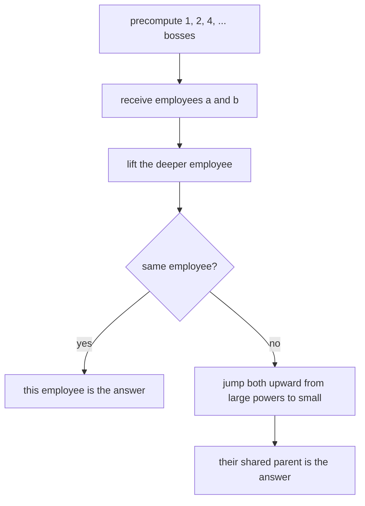

# Company Queries II

- Source: CSES
- USACO Guide ID: `cses-1688`
- Difficulty at selection: Easy (checked in [Guide source commit e8b01d6](https://github.com/cpinitiative/usaco-guide/blob/e8b01d6c58badcabbdd922b15d408d76e2beebf1/content/4_Gold/LCA_Euler.problems.json))
- Original problem: [CSES Company Queries II](https://cses.fi/problemset/task/1688)
- Tags: Lowest Common Ancestor, Binary Lifting, Trees
- Solution: [C++](../../solutions/cses-1688.cpp)

## Problem Summary

Employees form a rooted hierarchy with employee 1 as the director. For each pair of employees, report their lowest shared boss: the common ancestor that is as far down the hierarchy as possible.

This is a paraphrased study summary. Refer to the official page for the complete statement and constraints.

## Visualization Description

Draw the company hierarchy as a tree with the director at the top. Beside each employee, place upward arrows labeled 1, 2, 4, 8, and so on. For a query, first raise the deeper employee until both are on the same row. Then raise both together with the largest arrows that keep them at different employees. Their next boss is highlighted as the answer.

## Approach

Let `up[k][v]` be the ancestor reached by moving `2^k` bosses above employee `v`. The input lists every boss before that boss's employees, so depths and all binary-lifting entries can be built immediately while reading.

For a query, lift the deeper employee by the depth difference. If the two employees now match, that employee is the answer. Otherwise, inspect powers of two from largest to smallest. Whenever their `2^k` ancestors differ, move both employees there. After every safe jump is taken, the employees are distinct children of their lowest common boss, so return either parent.

## Correctness

The table invariant is that `up[k][v]` is exactly `2^k` edges above `v`: it is true for `k = 0` by the input, and the recurrence joins two correct `2^(k-1)` jumps.

Leveling preserves the set of common ancestors and gives both employees equal depth. If they match, that vertex is the lower employee's first ancestor at the other depth, so it is the lowest common boss. Otherwise, a jump is taken only when the resulting ancestors differ; therefore neither employee ever reaches or passes the LCA. Processing every power from largest to smallest leaves them as high as possible while distinct, which means both parents are the LCA. Thus every reported employee is exactly the lowest common boss.

## Complexity

- Preprocessing: `O(N log N)` time and `O(N log N)` space
- Each query: `O(log N)` time
- Total: `O((N + Q) log N)` time

## Verification

The smoke test uses the official sample. The independent verifier generates random valid hierarchies and compares each result with a simple ancestor-set oracle. A maximum-size chain checks the deepest legal hierarchy and all major lifting-bit combinations.
