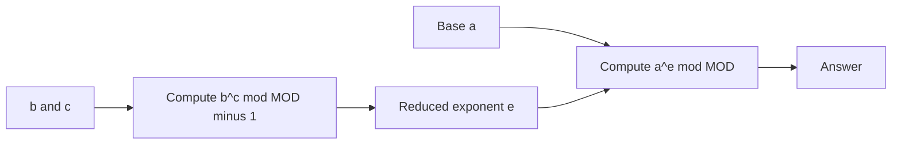

# Exponentiation II

- Source: CSES
- USACO Guide ID: `cses-1712`
- Difficulty at selection: Easy
- Original problem: [https://cses.fi/problemset/task/1712](https://cses.fi/problemset/task/1712)
- Tags: Modular Arithmetic, Binary Exponentiation
- Solution: [`../../solutions/cses-1712.cpp`](../../solutions/cses-1712.cpp)

## Problem Summary

For each query, compute `a^(b^c)` modulo `1,000,000,007`. The three input values can each be as large as one billion, so neither exponent can be built directly. The problem defines `0^0` as `1`.

This is a paraphrase for study notes. Use the original link for the official statement and constraints.

## Visualization Description

Think of the expression as two nested machines. The inner machine computes only where the huge exponent lands on a cycle of length `MOD-1`. The outer machine receives that compact exponent and performs another binary-power walk modulo `MOD`.

## Approach

Fermat's little theorem says `a^(MOD-1) = 1 (mod MOD)` for a positive `a` smaller than the prime `MOD`. Therefore, reduce the exponent `b^c` modulo `MOD-1`. Compute that reduction with binary exponentiation under modulus `MOD-1`, then compute `a^reducedExponent` with binary exponentiation under `MOD`.

The one non-coprime base allowed by the constraints is `a=0`. Detect whether the true exponent is zero: `b^c=0` exactly when `b=0` and `c>0`. This preserves the stated `0^0=1` convention and prevents a positive exponent that reduces to zero from being mistaken for an actual zero exponent.

## Correctness

If the true exponent is zero, the algorithm returns `1`, which equals `a^0` under the problem's convention. If `a=0` and the exponent is positive, it returns `0`, which is correct. Otherwise `a` is positive and coprime to prime `MOD`. Fermat's theorem makes powers of `a` repeat every `MOD-1` exponents, so replacing `b^c` by `b^c mod (MOD-1)` does not change the final residue. Both nested powers are computed exactly by binary exponentiation, so every printed answer is correct.

## Complexity

- Time: `O(log c + log MOD)` per query
- Extra space: `O(1)`

## Verification

The smoke test uses the official three-query example. Deterministic verification compares the program with Python's independent modular-power implementation over small exhaustive triples and targeted zero cases, including `0^(0^0)`, `0^(0^positive)`, and positive bases with a zero outer exponent.
