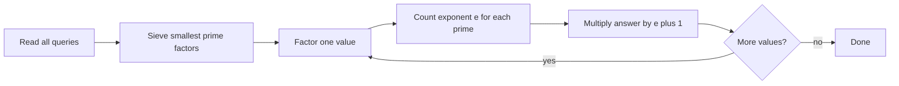

# Counting Divisors

- Source: CSES
- USACO Guide ID: `cses-1713`
- Difficulty at selection: Easy
- Original problem: [https://cses.fi/problemset/task/1713](https://cses.fi/problemset/task/1713)
- Tags: Divisibility, Prime Factorization, Sieve
- Solution: [`../../solutions/cses-1713.cpp`](../../solutions/cses-1713.cpp)

## Problem Summary

For each queried positive integer, report how many positive divisors it has. There can be many queries, while every value is at most one million.

This is a paraphrase for study notes. Use the original link for the official statement and constraints.

## Visualization Description

Show a factorization such as `72 = 2^3 * 3^2`. Under the factorization, draw four choices for the exponent of `2` and three choices for the exponent of `3`. A grid of `4 * 3 = 12` cells represents all independent combinations and therefore all divisors.

## Approach

Build a smallest-prime-factor table through the largest input. Then factor each number by repeatedly looking up one prime and dividing out its entire exponent. If `x = p1^e1 * p2^e2 * ...`, a divisor chooses an exponent from `0` through `ei` independently for every prime. The answer is therefore `(e1+1)(e2+1)...`. The value `1` has an empty factorization, so the product correctly remains one.

## Correctness

The sieve assigns every integer greater than one a prime factor. Repeated division therefore recovers its unique prime factorization. For each prime `pi`, a divisor may contain exactly `0,1,...,ei` copies, giving `ei+1` choices. Choices for different primes are independent, and unique factorization makes every combination a different divisor. Multiplying the choice counts consequently produces exactly the number of positive divisors.

## Complexity

Let `M` be the largest queried value and `F` the total number of prime factors across all queries, counted with multiplicity.

- Time: `O(M log log M + F)`
- Extra space: `O(M)`

## Verification

The smoke test uses the official example and includes `1`, a prime, a square, and a highly composite value. Deterministic verification checks every value through `2,000` against direct divisor enumeration.
