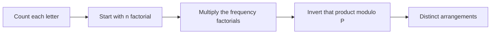

# Creating Strings II

- Source: CSES
- USACO Guide ID: `cses-1715`
- Difficulty at selection: Easy
- Original problem: [https://cses.fi/problemset/task/1715](https://cses.fi/problemset/task/1715)
- Tags: Combinatorics, Modular Arithmetic
- Solution: [`../../solutions/cses-1715.cpp`](../../solutions/cses-1715.cpp)

## Problem Summary

Given a lowercase string of length up to one million, count how many distinct strings can be formed by rearranging all its characters. Equal letters are indistinguishable, and the answer is needed modulo `1,000,000,007`.

This is a paraphrase for study notes. Use the original link for the official statement and constraints.

## Visualization Description

Pretend every copy of every letter first wears a unique name tag. Then all `n!` orders look different. If a letter occurs `c` times, removing its name tags merges each group of `c!` orders into one visible string. Dividing by the factorial for every frequency removes exactly those duplicate labels.

## Approach

Let `count[x]` be the frequency of letter `x`. The number of distinct permutations of a multiset is

`n! / (count[a]! count[b]! ... count[z]!)`.

Precompute all factorials through `n`. Ordinary division is not valid after taking remainders, so build the denominator modulo the prime `P = 1,000,000,007` and multiply by `denominator^(P-2) mod P`. Fermat's little theorem guarantees that this power is the modular inverse because `n < P`, so none of the factorials is divisible by `P`.

## Correctness

If every character occurrence were labeled, there would be `n!` permutations. For each letter with frequency `c`, permuting its `c` labels changes no visible character string, so every distinct result is counted exactly `c!` times from that letter. These label permutations are independent across letters, making the total duplicate factor the product of all frequency factorials. The formula therefore counts every distinct rearrangement once. Fermat's theorem replaces division by that nonzero denominator with equivalent multiplication modulo `P`, so the algorithm prints the required remainder.

## Complexity

- Time: `O(n + log P)`
- Extra space: `O(n)` for factorials and `O(1)` for 26 frequencies

## Verification

The smoke test uses the official `aabac` example. Deterministic checks enumerate and deduplicate every permutation of several short strings, including all-equal, all-distinct, and mixed-frequency inputs, then compare those counts with the program.
