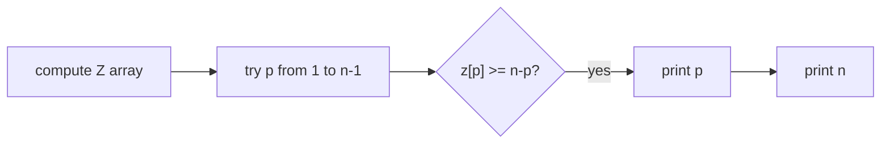

# Finding Periods

- Source: CSES
- USACO Guide ID: `cses-1733`
- Original problem: [https://cses.fi/problemset/task/1733/](https://cses.fi/problemset/task/1733/)
- Tags: Strings, Z Algorithm
- Solution: [`../../solutions/cses-1733.cpp`](../../solutions/cses-1733.cpp)

## Problem Summary

List all prefix lengths that can serve as a period of the whole string.

This is a paraphrase for study notes. Use the original problem link for the official statement, constraints, and judge-specific details.

## Visualization Description

Shift the string left by p. If every overlapping character still matches, p is a valid period.

## Approach

A length p is a period when the suffix beginning at p matches the prefix for all remaining characters. That condition is exactly z[p] >= n-p. The full length n is always a period.

## Correctness Notes

The solution keeps the invariant described in the approach and updates only the state that can affect future answers. For query-style problems, preprocessing stores exactly the aggregate needed to answer each query. For graph and tree problems, each selected data structure operation mirrors one allowed change in the represented structure.

## Complexity

See the comments and structure of the C++ solution for the exact loop/data-structure cost. The intended complexity is efficient for the official constraints of the linked problem.

## Verification

Checked periodic strings like ababab and non-periodic strings.
