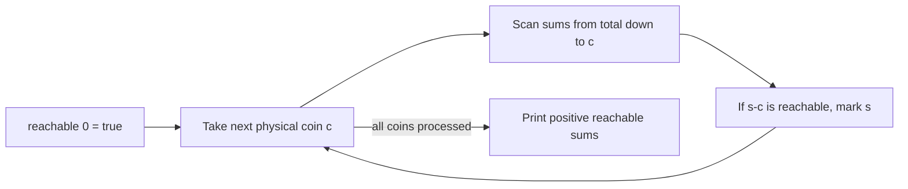

# Money Sums

- Source: CSES
- USACO Guide ID: `cses-1745`
- Difficulty at selection: Easy
- Original problem: [CSES — Money Sums](https://cses.fi/problemset/task/1745)
- Tags: Dynamic Programming, 0/1 Knapsack, Subset Sum
- Solution: [`../../solutions/cses-1745.cpp`](../../solutions/cses-1745.cpp)

## Problem Summary

Given a collection of physical coins, find every positive total that can be made by choosing any subset of them. Two coins with the same value are still separate coins, and each coin can be used at most once. Print the number of distinct totals and the totals in increasing order.

This summary is paraphrased for study. Use the official link for the full statement and constraints.

## Visualization Description

Lay out cells from zero to the sum of all coin values. Cell zero begins lit. When a coin worth `c` is processed, every previously lit cell can light the cell `c` steps to its right. Moving from high sums to low sums ensures that newly lit cells wait until the next physical coin before creating more sums.

## Approach

Let `reachable[s]` say whether some subset of processed coins totals `s`. Set only `reachable[0]` initially. For each coin `c`, scan sums downward and mark `s` whenever `s-c` was reachable before using this coin. Finally collect all true positions from `1` through the total value; scanning them numerically also produces the required sorted order.

## Correctness

Induct on the number of processed coins. With no coins, only sum zero is possible. When coin `c` arrives, every achievable subset either excludes it, so its sum was already reachable, or includes it, so removing `c` leaves a subset of earlier coins totaling `s-c`. The update marks exactly these second-case sums. Because it scans downward, `reachable[s-c]` cannot depend on this same coin, so the coin is never reused. The invariant holds after every coin, and the final true entries are exactly all obtainable positive sums.

## Complexity

- Time: `O(N S)`, where `S` is the sum of all coin values
- Space: `O(S)`

## Verification

The smoke test uses the official sample. The independent verifier enumerates every subset of small random coin lists, places the sums in a set, sorts them, and compares both the reported count and list. Extra cases cover one coin, duplicate values, gaps, and a continuous range of reachable totals.
