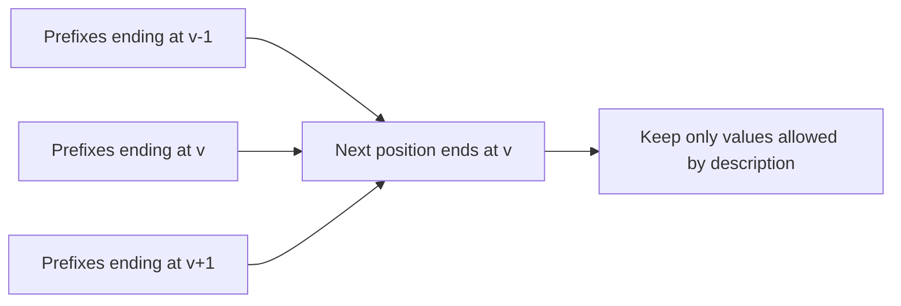

# Array Description

- Source: CSES
- USACO Guide ID: `cses-1746`
- Difficulty at selection: Easy (checked in [Guide source commit ecd27b6](https://github.com/cpinitiative/usaco-guide/blob/ecd27b6eff69112891eabf0c968d3ad0b2a7f745/content/4_Gold/Paths_Grids.problems.json))
- Original problem: [Array Description](https://cses.fi/problemset/task/1746)
- Tags: Dynamic Programming, Sequences
- Solution: [C++](../../solutions/cses-1746.cpp)

## Problem Summary

An array has values from 1 through `m`, and neighboring values may differ by at most one. Some positions are fixed while zero marks an unknown position. Count all complete arrays consistent with both rules, modulo 1,000,000,007.

This summary is paraphrased for study. Refer to the official problem for the complete statement and constraints.

## Visualization Description

Make one column for every array position and one row for every possible value. A fixed entry leaves only one square active in its column; an unknown leaves all rows available. Draw arrows from value `v` in one column to `v-1`, `v`, and `v+1` in the next. The answer is the sum of the path counts in the final column.

## Approach

Let `dp[v]` count valid prefixes whose latest value is `v`. Initialize the first position with one way for each value allowed there. For every later position and each allowed value `v`, sum the previous counts ending at `v-1`, `v`, and `v+1`. Two zero sentinels eliminate special boundary cases. Only the previous and current rows are needed.

## Correctness

Take any valid prefix ending in `v`. Its previous value must be exactly one of `v-1`, `v`, or `v+1`; conversely, appending `v` to any valid prefix ending in one of those values preserves the adjacency rule. The transition therefore counts every valid extension once and no invalid extension. Fixed positions reject all values except the stated one. By induction on positions, each DP entry counts exactly the matching prefixes with its ending value. Summing the last row counts every complete valid array exactly once.

## Complexity

There are `n` positions and `m` candidate values. Time is O(nm), and the two rolling rows use O(m) memory.

## Verification

The official sample is smoke-tested. Independent enumeration tries every possible completion for small `n` and `m`. Tests cover one position, `m=1`, all fixed, all unknown, impossible adjacent fixed values, modular wraparound, random descriptions, and the maximum dimensions.
