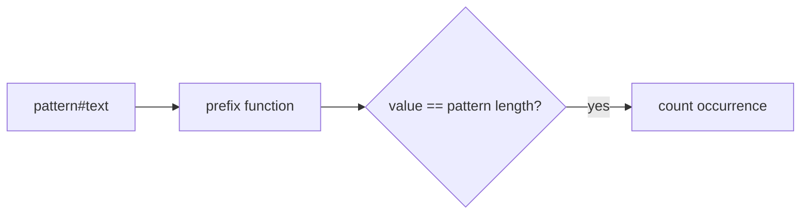

# String Matching

- Source: CSES
- USACO Guide ID: `cses-1753`
- Original problem: [https://cses.fi/problemset/task/1753](https://cses.fi/problemset/task/1753)
- Tags: Strings, KMP
- Solution: [`../../solutions/cses-1753.cpp`](../../solutions/cses-1753.cpp)

## Problem Summary

Count how many times a pattern appears in a text.

This is a paraphrase for study notes. Use the original problem link for the official statement, constraints, and judge-specific details.

## Visualization Description

The prefix function measures how much of the pattern is currently matched as the scan moves through the text.

## Approach

Build the prefix function for pattern + separator + text. Whenever the prefix-function value equals the pattern length, an occurrence ends at that position. KMP avoids backing up in the text.

## Correctness Notes

The solution keeps the invariant described in the approach and updates only the state that can affect future answers. For query-style problems, preprocessing stores exactly the aggregate needed to answer each query. For graph and tree problems, each selected data structure operation mirrors one allowed change in the represented structure.

## Complexity

See the comments and structure of the C++ solution for the exact loop/data-structure cost. The intended complexity is efficient for the official constraints of the linked problem.

## Verification

Checked overlapping matches like aaa in aaaaa and no-match cases.
