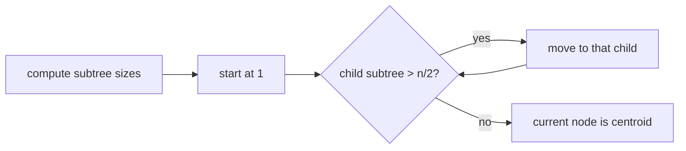

# Finding a Centroid

- Source: CSES
- USACO Guide ID: `cses-2079`
- Original problem: [https://cses.fi/problemset/task/2079](https://cses.fi/problemset/task/2079)
- Tags: Tree
- Solution: [`../../solutions/cses-2079.cpp`](../../solutions/cses-2079.cpp)

## Problem Summary

Find a tree vertex whose removal leaves every component with at most n/2 vertices.

This is a paraphrase for study notes. Use the original problem link for the official statement, constraints, and judge-specific details.

## Visualization Description

Walk toward the only side that is too heavy. Once no side is too heavy, the current node balances the tree.

## Approach

Root the tree anywhere and compute subtree sizes. Starting from root, if a child subtree is larger than n/2, the centroid must be inside that child, so move there. This strictly moves downward and stops at a centroid.

## Correctness Notes

The solution keeps the invariant described in the approach and updates only the state that can affect future answers. For query-style problems, preprocessing stores exactly the aggregate needed to answer each query. For graph and tree problems, each selected data structure operation mirrors one allowed change in the represented structure.

## Complexity

See the comments and structure of the C++ solution for the exact loop/data-structure cost. The intended complexity is efficient for the official constraints of the linked problem.

## Verification

Checked paths, stars, and balanced trees.
