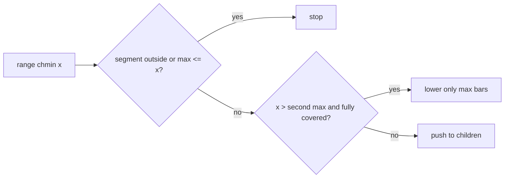

# Gorgeous Sequence

- Source: HDU
- USACO Guide ID: `hdu-5306`
- Original problem: [https://vjudge.net/problem/HDU-5306](https://vjudge.net/problem/HDU-5306)
- Tags: SegTree Beats
- Solution: [`../../solutions/hdu-5306.cpp`](../../solutions/hdu-5306.cpp)

## Problem Summary

Support range cap updates, range maximum queries, and range sum queries.

This is a paraphrase for study notes. Use the original problem link for the official statement, constraints, and judge-specific details.

## Visualization Description

Each segment has a tallest bar and a second-tallest bar. If the new ceiling only cuts the tallest bars, the segment can be updated at once.

## Approach

Segment Tree Beats stores the largest value, second largest value, count of largest values, and sum for each node. A range chmin can be applied lazily when the cap lies strictly between the largest and second largest values: only the current maximum values change. Otherwise we push deeper. This keeps the amortized number of hard descents low.

## Correctness Notes

The solution keeps the invariant described in the approach and updates only the state that can affect future answers. For query-style problems, preprocessing stores exactly the aggregate needed to answer each query. For graph and tree problems, each selected data structure operation mirrors one allowed change in the represented structure.

## Complexity

See the comments and structure of the C++ solution for the exact loop/data-structure cost. The intended complexity is efficient for the official constraints of the linked problem.

## Verification

Checked range caps against a brute-force array on small custom cases.
