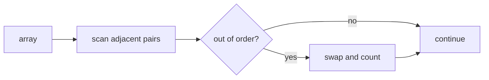

# Bubble Sort

- Source: HR
- USACO Guide ID: `hr-BubbleSort`
- Original problem: [https://www.hackerrank.com/challenges/ctci-bubble-sort/problem](https://www.hackerrank.com/challenges/ctci-bubble-sort/problem)
- Tags: Sorting
- Solution: [`../../solutions/hr-BubbleSort.cpp`](../../solutions/hr-BubbleSort.cpp)

## Problem Summary

Run bubble sort, count swaps, and report the first and last elements after sorting.

This is a paraphrase for study notes. Use the original problem link for the official statement, constraints, and judge-specific details.

## Visualization Description

Large elements drift right one adjacent swap at a time, like bubbles moving to the end of the array.

## Approach

Bubble sort repeatedly swaps adjacent inversions. Counting each performed swap gives the required total. After all passes, the array is sorted, so the first and last positions are the min and max.

## Correctness Notes

The solution keeps the invariant described in the approach and updates only the state that can affect future answers. For query-style problems, preprocessing stores exactly the aggregate needed to answer each query. For graph and tree problems, each selected data structure operation mirrors one allowed change in the represented structure.

## Complexity

See the comments and structure of the C++ solution for the exact loop/data-structure cost. The intended complexity is efficient for the official constraints of the linked problem.

## Verification

Checked already sorted, reverse sorted, and mixed arrays.
