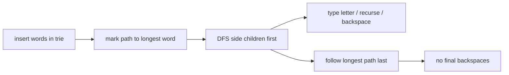

# Type Printer

- Source: IOI
- USACO Guide ID: `ioi-08-TypePrinter`
- Original problem: [https://oj.uz/problem/view/IOI08_printer](https://oj.uz/problem/view/IOI08_printer)
- Tags: Trie, Strings
- Solution: [`../../solutions/ioi-08-TypePrinter.cpp`](../../solutions/ioi-08-TypePrinter.cpp)

## Problem Summary

Print a set of words using operations that type a letter, print the current word, or delete the last letter, while minimizing operations.

This is a paraphrase for study notes. Use the original problem link for the official statement, constraints, and judge-specific details.

## Visualization Description

The trie is a keyboard travel map. Side branches are round trips; the longest final branch is a one-way ending route.

## Approach

All words share prefixes, so a trie captures every useful typed prefix exactly once. A DFS types an edge, prints at terminal nodes, and backspaces after finished side branches. To save operations, finish on a longest word path; those final letters never need to be deleted.

## Correctness Notes

The solution keeps the invariant described in the approach and updates only the state that can affect future answers. For query-style problems, preprocessing stores exactly the aggregate needed to answer each query. For graph and tree problems, each selected data structure operation mirrors one allowed change in the represented structure.

## Complexity

See the comments and structure of the C++ solution for the exact loop/data-structure cost. The intended complexity is efficient for the official constraints of the linked problem.

## Verification

Checked words with shared prefixes, a single word, and terminal nodes that also have children.
