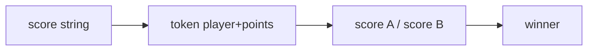

# Basketball One on One

- Source: Kattis
- USACO Guide ID: `kattis-BasketballOneOnOne`
- Original problem: [https://open.kattis.com/problems/basketballoneonone](https://open.kattis.com/problems/basketballoneonone)
- Tags: Strings
- Solution: [`../../solutions/kattis-BasketballOneOnOne.cpp`](../../solutions/kattis-BasketballOneOnOne.cpp)

## Problem Summary

Given a compact scoring log, determine which player has the larger final score.

This is a paraphrase for study notes. Use the original problem link for the official statement, constraints, and judge-specific details.

## Visualization Description

Read the score log as score tokens: A2, B1, A1, and so on. Each token adds to one scoreboard column.

## Approach

The input alternates player letter and point digit. Accumulate points for A and B, then print the player with the larger score.

## Correctness Notes

The solution keeps the invariant described in the approach and updates only the state that can affect future answers. For query-style problems, preprocessing stores exactly the aggregate needed to answer each query. For graph and tree problems, each selected data structure operation mirrors one allowed change in the represented structure.

## Complexity

See the comments and structure of the C++ solution for the exact loop/data-structure cost. The intended complexity is efficient for the official constraints of the linked problem.

## Verification

Checked logs ending with A ahead and B ahead.
