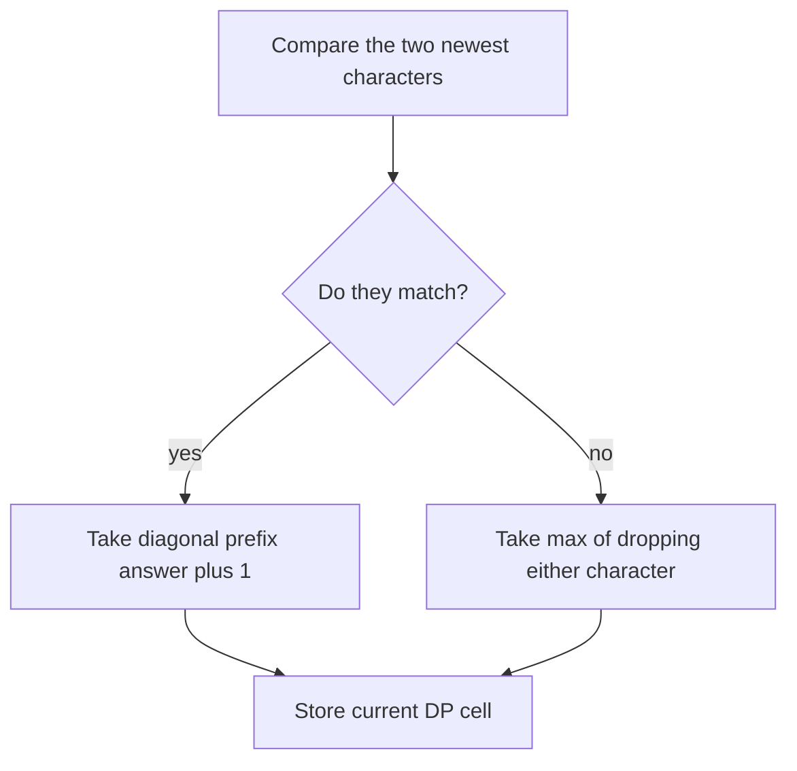

# Longest Common Subsequence

- Source: LeetCode
- USACO Guide ID: `lc-LongestCommonSubsequence`
- Difficulty at selection: Easy (checked in [Guide source commit ecd27b6](https://github.com/cpinitiative/usaco-guide/blob/ecd27b6eff69112891eabf0c968d3ad0b2a7f745/content/4_Gold/Paths_Grids.problems.json))
- Original problem: [Longest Common Subsequence](https://leetcode.com/problems/longest-common-subsequence/)
- Tags: Dynamic Programming, Strings
- Solution: [C++](../../solutions/lc-LongestCommonSubsequence.cpp)

## Problem Summary

Given two lowercase strings, find the greatest possible length of a sequence of characters that appears in the same relative order in both strings. Characters may be skipped, but the remaining characters cannot be rearranged.

This summary is paraphrased for study. Refer to the official problem for the complete statement and constraints.

## Visualization Description

Draw the first string down the left side of a grid and the second string across the top. Cell `(i,j)` records the best common-subsequence length for the two prefixes ending there. A matching pair of letters points diagonally to the upper-left cell and adds one. A mismatch receives arrows from above and left and keeps the larger value. Highlighting one row at a time shows why only two rows of memory are needed.

## Approach

Let `dp[i][j]` be the LCS length between the first `i` characters of one string and the first `j` characters of the other. If the newest characters match, append that character to an optimal solution for the two shorter prefixes. Otherwise, an optimal common subsequence omits at least one of the two different newest characters, so take the better answer after omitting either one.

The implementation keeps only the previous and current rows. It places the shorter string on the column axis, reducing memory to `O(min(n,m))`. A small `main` function provides repository-friendly input/output; the `Solution` method has the judge-facing signature.

## Correctness

We prove each DP cell stores the correct LCS length for its pair of prefixes. Empty prefixes correctly have value zero. If the two newest characters match, there is an optimal LCS that uses this matching final pair, so its length is the diagonal prefix answer plus one. If they differ, no common subsequence can use both as its final character; at least one must be omitted, and the best possibilities are exactly the cells above and to the left. Thus the transition selects an optimal value in both cases. Induction over the grid proves the bottom-right value is the requested LCS length.

## Complexity

- Time: `O(nm)`
- Space: `O(min(n,m))`

## Verification

All official examples are represented by smoke or verifier cases. An independent oracle enumerates subsequences of the shorter string for small random inputs and tests membership in the other string. Tests also cover identical strings, disjoint alphabets, repeated letters, symmetry, and two maximum-length strings.
