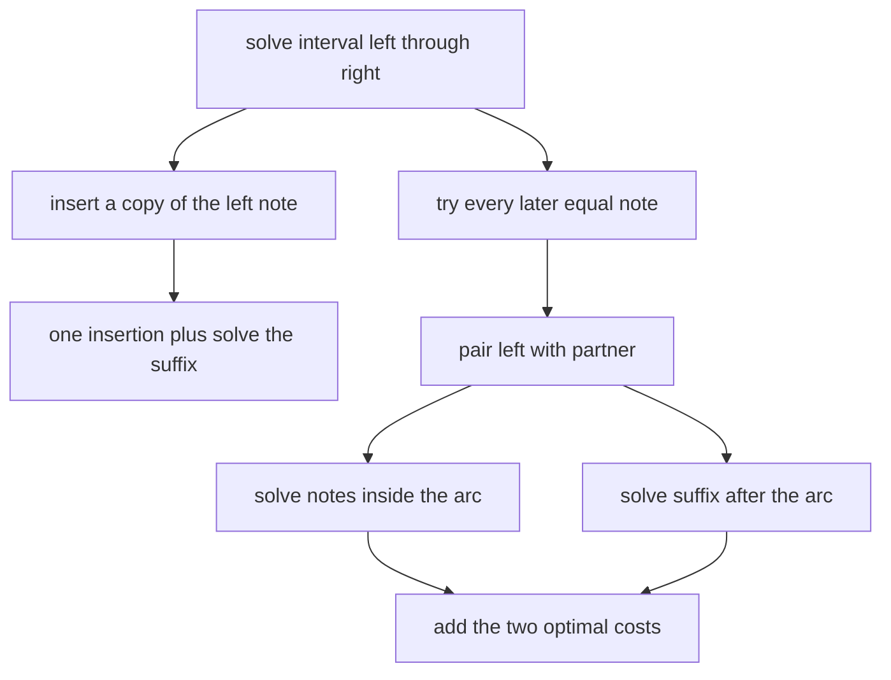

# Space Jazz

- Source: South African Programming Olympiad 2015 Final Round
- USACO Guide ID: `sapo-15-SpaceJazz`
- Difficulty at selection: Easy (checked in [Guide source commit ed367e8](https://github.com/cpinitiative/usaco-guide/blob/ed367e8953e137e603d09a36fd7040dcf2e30667/content/4_Gold/DP_Ranges.problems.json))
- Original problem: [SAPO Space Jazz](https://saco-evaluator.org.za/cms/sapo2015z/tasks/jazz/description)
- Tags: Range DP, Strings, Noncrossing Matching
- Solution: [C++](../../solutions/sapo-15-SpaceJazz.cpp)

## Problem Summary

A valid composition begins with a doubled note and repeatedly inserts another doubled note between adjacent notes. A performance preserves the order of the original composition but may omit notes. Given the performed lowercase string, find the smallest number of missing notes that must be restored to obtain some valid composition.

This summary is paraphrased for study. Refer to the official problem for the complete statement and constraints.

## Visualization Description

Draw arcs above the string. Equal notes that belong to the same inserted pair are joined by an arc, and valid arcs never cross. For the leftmost note, either draw a tiny arc to a newly inserted copy, or connect it to each later equal note in turn. A chosen arc separates its interior from the suffix, producing two smaller independent intervals.

## Approach

Let `additions[left][right]` be the minimum insertions needed for the inclusive substring. An empty interval costs zero. The first observed note can always receive one inserted copy, after which only `[left+1, right]` remains. If a later position `partner` contains the same note, those two observed notes can form a pair instead; noncrossing construction makes the inside `[left+1, partner-1]` and the suffix `[partner+1, right]` independent.

Take the minimum of the inserted-copy choice and every equal-partner choice. Fill intervals in increasing order of length so every dependency is already known.

## Correctness

Consider an optimal completion of one interval and its leftmost observed note. That note is paired either with an inserted copy or with a later observed equal note. In the first case, deleting the pair leaves exactly the suffix, so the fallback transition has the optimal remaining cost. In the second case, the pair's arc cannot cross any other pair. All notes inside it and all notes after it must therefore be completed independently, exactly as the split transition calculates. The recurrence considers the actual partner used by every optimal completion, so it never costs more than optimal. Each transition also constructs a valid completion, so it never costs less than optimal. By induction on interval length, every table entry, including the full string, is correct.

## Complexity

- Time: `O(N^3)`
- Space: `O(N^2)`

## Verification

The smoke test uses the published sample. The independent verifier compares against exhaustive noncrossing matchings for hundreds of short random strings, checks one-note, already-valid, nested, and alternating patterns, and includes a maximum-length all-equal string.
