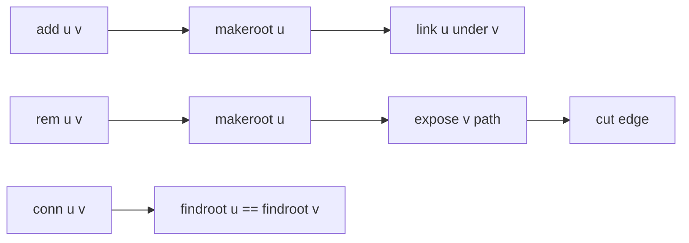

# Dynamic Connectivity

- Source: SPOJ
- USACO Guide ID: `spoj-DynamicConnectivity`
- Original problem: [https://www.spoj.com/problems/DYNACON1](https://www.spoj.com/problems/DYNACON1)
- Tags: LCT, Tree
- Solution: [`../../solutions/spoj-DynamicConnectivity.cpp`](../../solutions/spoj-DynamicConnectivity.cpp)

## Problem Summary

Maintain a forest under edge insertions, edge removals, and connectivity queries.

This is a paraphrase for study notes. Use the original problem link for the official statement, constraints, and judge-specific details.

## Visualization Description

Think of the forest as flexible paths. Access operations expose exactly the path we need, then link or cut rewires one edge while preserving the rest.

## Approach

Because every add operation connects two different trees, the graph remains a forest. A link-cut tree represents each tree with splay trees. `makeroot` reroots a represented tree, `link` adds an edge, `cut` removes a known tree edge, and `findroot` identifies the represented-tree root for connectivity.

## Correctness Notes

The solution keeps the invariant described in the approach and updates only the state that can affect future answers. For query-style problems, preprocessing stores exactly the aggregate needed to answer each query. For graph and tree problems, each selected data structure operation mirrors one allowed change in the represented structure.

## Complexity

See the comments and structure of the C++ solution for the exact loop/data-structure cost. The intended complexity is efficient for the official constraints of the linked problem.

## Verification

Checked the SPOJ-style sample sequence from the mirrored statement and repeated add/remove cycles.
