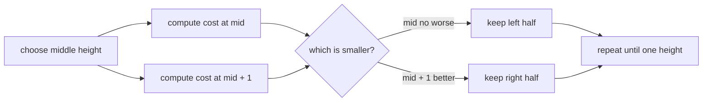

# Building Construction

- Source: SPOJ
- USACO Guide ID: `spoj-KOPC12A`
- Difficulty at selection: Easy (checked in [Guide source commit 7bf6d95](https://github.com/cpinitiative/usaco-guide/blob/7bf6d95ba5cbca9c37bc5cb96514a80b134bd4a5/content/4_Gold/Ternary_Search.problems.json))
- Original problem: [SPOJ KOPC12A](https://www.spoj.com/problems/KOPC12A/)
- Tags: Convex Functions, Binary Search, Ternary Search
- Solution: [C++](../../solutions/spoj-KOPC12A.cpp)

## Problem Summary

Each building has a height and its own price per brick added or removed. Choose one integer height for every building and minimize the total rebuilding price over several test cases.

This is a paraphrased study summary. Refer to the official page for the complete statement and constraints.

## Visualization Description

Draw one V-shaped cost graph per building. Building `i` reaches zero cost at its current height and rises by `cost[i]` for every step away. Stacking these graphs vertically produces one convex total-cost curve. A marker compares neighboring integer heights `mid` and `mid + 1` and moves toward the lower side.

## Approach

For target height `x`, evaluate `sum(cost[i] * abs(height[i] - x))`. Every term is a convex V shape, so their sum is convex on the integer heights.

Binary-search the slope of that curve. If `f(mid) <= f(mid + 1)`, an optimum is at or left of `mid`; otherwise the curve is still descending and the optimum is right of `mid`. Search from zero through the largest input height.

## Correctness

For every building, moving the target one step farther from its original height never makes that building's marginal cost smaller. Therefore each individual cost is convex, and adding all buildings preserves convexity.

During the search, if `f(mid) <= f(mid + 1)`, convexity prevents a later decreasing section, so discarding heights right of `mid` keeps an optimum. If `f(mid) > f(mid + 1)`, the curve is descending there, so no optimum lies at or left of `mid`. The interval always retains an optimum and ends at one height; evaluating it gives the minimum total rebuilding cost.

## Complexity

- Time: `O(N log H)` per test case, where `H` is the largest height
- Space: `O(N)`

## Verification

The smoke test covers the official sample. The independent verifier compares random small cases with exhaustive evaluation of every possible target height, plus zero-cost, flat-optimum, and maximum-value cases.
