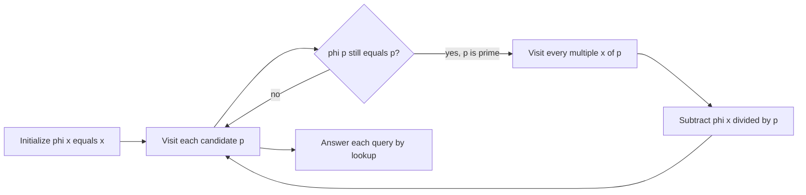

# ETF - Euler Totient Function

- Source: SPOJ
- USACO Guide ID: `spoj-etm`
- Difficulty at selection: Easy
- Original problem: [https://www.spoj.com/problems/ETF/](https://www.spoj.com/problems/ETF/)
- Tags: Euler Totient, Sieve, Prime Factors
- Solution: [`../../solutions/spoj-etm.cpp`](../../solutions/spoj-etm.cpp)

## Problem Summary

For each requested positive integer `n`, compute Euler's totient `phi(n)`: the number of integers from `1` through `n` that share no factor greater than one with `n`. The special value is `phi(1) = 1`.

This is a paraphrase for study notes. Use the original link for the official statement and constraints.

## Visualization Description

Imagine each number starting with a pool of `n` candidates. When the sieve reaches a prime `p`, every multiple of `p` crosses out exactly a `1/p` fraction of its remaining pool. After all distinct prime divisors have acted, the survivors are precisely the numbers coprime to `n`.

## Approach

Read all queries and find their maximum. Initialize `phi[x] = x` through that maximum. An untouched value `phi[p] == p` identifies a prime. For every multiple `x` of that prime, apply `phi[x] -= phi[x] / p`. This is the exact integer form of Euler's product formula.

Precomputing once is especially useful because the input contains many queries. It also naturally preserves the required `phi(1) = 1` base case.

## Correctness

For an integer `x` with distinct prime divisors `p`, Euler's formula is `phi(x) = x * product(1 - 1/p)`. The sieve finds every prime exactly once. When prime `p` visits a multiple `x`, the update replaces the factor `p` with `p-1`, exactly multiplying the current value by `1 - 1/p`. Therefore, after every distinct prime divisor of `x` has visited it, `phi[x]` equals Euler's formula and counts exactly the values coprime to `x`. Each printed lookup is consequently correct.

## Complexity

- Precomputation: `O(M log log M)` time and `O(M)` space, where `M` is the largest query
- Each answer: `O(1)` time

## Verification

The smoke test covers `1`, primes, prime powers, and composite values. The deterministic verifier computes every small answer independently by checking `gcd(candidate, n) == 1` and compares it with the C++ program.
