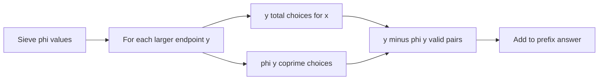

# NAJPWG - Playing with GCD

- Source: SPOJ
- USACO Guide ID: `spoj-najpwg`
- Difficulty at selection: Easy
- Original problem: [https://www.spoj.com/problems/NAJPWG/](https://www.spoj.com/problems/NAJPWG/)
- Tags: Divisibility, Euler Totient, Prefix Sums
- Solution: [`../../solutions/spoj-najpwg.cpp`](../../solutions/spoj-najpwg.cpp)

## Problem Summary

For each limit `n`, count unordered pairs `(x, y)` drawn from `1` through `n` whose greatest common divisor is greater than one. Reversing a pair does not create a new pair, and equal endpoints are allowed.

This is a paraphrase for study notes. Use the original link for the official statement and constraints.

## Visualization Description

Arrange all pairs in a triangular grid where the column labeled `y` contains `(1,y)` through `(y,y)`. This orientation counts each unordered pair once. Of the `y` cells in a column, `phi(y)` are coprime and the other `y - phi(y)` are wanted. A prefix sum across columns answers every query.

## Approach

Read all limits, sieve Euler totients through the largest one, and build `answer[n] = answer[n-1] + n - phi[n]`. For a fixed larger endpoint `y`, there are `y` choices `1 <= x <= y`; exactly `phi[y]` have gcd one. Assigning every unordered pair to its larger endpoint avoids double counting. Answer each test case with its prefix-table entry and the required case label.

## Correctness

Every unordered pair from the range has one unique representation with `x <= y`, so it belongs to exactly one column `y`. In that column, the definition of Euler's totient says precisely `phi(y)` of the `y` possible `x` values are coprime to `y`. Therefore exactly `y - phi(y)` pairs have gcd greater than one. Summing this count for every `y <= n` counts all valid pairs once and no invalid pair, so the prefix answer is correct.

## Complexity

- Precomputation: `O(M log log M)` time and `O(M)` space, where `M` is the largest query
- Each answer: `O(1)` time

## Verification

The smoke test covers the first several prefix values and a larger composite-rich range. The deterministic verifier enumerates every small pair `1 <= x <= y <= n`, calculates its gcd directly, and compares the resulting count with the C++ output.
