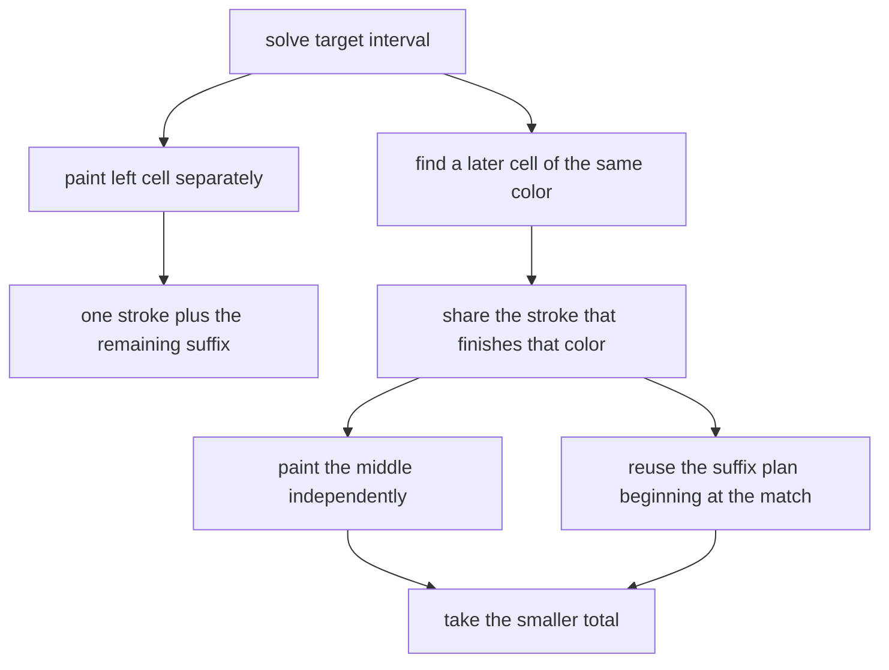

# Modern Art 3

- Source: USACO February 2021 Gold
- USACO Guide ID: `usaco-1114`
- Difficulty at selection: Easy (checked in [Guide source commit ed367e8](https://github.com/cpinitiative/usaco-guide/blob/ed367e8953e137e603d09a36fd7040dcf2e30667/content/4_Gold/DP_Ranges.problems.json))
- Original problem: [USACO Modern Art 3](https://www.usaco.org/index.php?page=viewproblem2&cpid=1114)
- Tags: Range DP, Interval Painting
- Solution: [C++](../../solutions/usaco-1114.cpp)

## Problem Summary

A one-dimensional canvas must end with a specified color in every cell. One brush stroke paints any contiguous interval a single color, and later strokes may cover earlier paint. Find the minimum number of strokes needed to create the target row.

This summary is paraphrased for study. Refer to the official problem for the complete statement and constraints.

## Visualization Description

Stack colored interval strips in time order. A long early strip may connect two cells of the same final color even when later, shorter strips repaint the cells between them. In the DP table, each square represents one target interval. Matching the left cell with a later equal color lets their shared strip surround a completed middle interval.

## Approach

Let `strokes[left][right]` be the minimum strokes for the inclusive target interval. A single cell costs one stroke. For a longer interval, the left cell can be painted separately, giving `1 + strokes[left+1][right]`. If position `match` has the same target color as `left`, extend the stroke responsible for `match` leftward to cover `left` as well; later strokes for the middle hide any unwanted paint. This costs `strokes[left+1][match-1] + strokes[match][right]`, with an empty middle costing zero.

Try every matching position and process intervals by increasing length.

## Correctness

Take an optimal painting of `[left,right]` and inspect the stroke that leaves the final color at `left`. If it contributes to no later cell with that same final color, the left cell can be charged as one separate stroke and the suffix needs its optimal solution. Otherwise, let `match` be a later same-colored cell reached by that stroke. Cells strictly between the two positions must obtain their final appearance through other strokes, while the shared stroke can be included in an optimal plan beginning at `match`. The matching transition combines exactly those two parts without double-counting the shared stroke. Thus every optimal painting is represented by some transition, and every transition describes a realizable painting. Induction over interval length proves the full answer is minimal.

## Complexity

- Time: `O(N^3)`
- Space: `O(N^2)`

## Verification

The smoke test uses the official sample. The independent verifier reverses tiny paintings by exhaustively removing possible last strokes, then compares that oracle with the C++ answer on hundreds of random rows. It also checks one color, all distinct colors, separated repeats, nested layers, and both maximum-size extremes.
