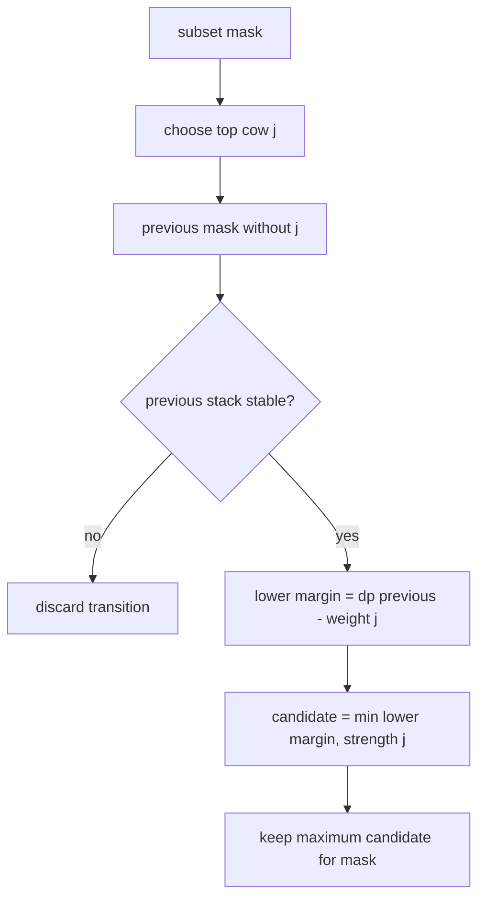

# Guard Mark

- Source: USACO December 2014 Gold
- USACO Guide ID: `usaco-494`
- Difficulty at selection: Easy (checked in [Guide source commit 1f63a5e](https://github.com/cpinitiative/usaco-guide/blob/1f63a5eea89f25ee8e71178d1596b92f0b87bb46/content/4_Gold/DP_Bitmasks.problems.json))
- Original problem: [Guard Mark](https://www.usaco.org/index.php?page=viewproblem2&cpid=494)
- Tags: Bitmask DP, Subsets, Optimization
- Solution: [C++](../../solutions/usaco-494.cpp)

## Problem Summary

A group of cows may stand on one another to reach a required height. Each cow has a height, weight, and strength: her strength limits the total weight above her. Choose some cows and order them into a stable stack that reaches the target, then maximize the stack's safety factor, meaning the smallest remaining strength anywhere in the stack. Report failure if no stable tall-enough stack exists.

This summary is paraphrased for study. Refer to the official problem for the complete statement and constraints.

## Visualization Description

Picture each subset as a box containing every possible order of those cows. Instead of storing all orders, the box keeps only the greatest safety factor. To build a state, choose which cow is on top. The smaller state already optimizes the cows below her. Adding the top cow subtracts her weight from every lower cow's spare capacity, while her own strength becomes one more possible bottleneck.

## Approach

Let `safety[mask]` be the maximum safety factor achievable by a stable ordering of exactly the selected cows. Set `safety[0]` to infinity. For every nonempty subset, try each selected cow as the top cow. If the remaining subset is stable, the lower stack's safety drops by the new cow's weight, and the new cow contributes her own strength limit. Therefore the candidate value is `min(safety[previous] - weight[j], strength[j])`. Keep the maximum nonnegative candidate.

The subset's total height is independent of ordering, so compute `height[mask]` from one removed bit. Finally, maximize `safety[mask]` over all masks whose height reaches the requirement.

## Correctness

For the empty stack, infinite spare capacity is the correct neutral value. Consider a nonempty subset and any stable ordering of it. That ordering has one specific top cow `j`; after removing her, the cows below form an ordering of `mask without j`. Adding `j` reduces the lower stack's safety by her weight and is also limited by `j`'s strength, exactly matching the transition. Conversely, every nonnegative transition produces a stable stack by placing `j` on the chosen lower ordering. Trying every possible top cow covers every ordering, and taking the maximum preserves the best safety factor. Thus each DP state is exact, and the final height filter returns the best valid answer.

## Complexity

- Time: `O(N * 2^N)`
- Space: `O(2^N)`

## Verification

The smoke test uses the official sample. The independent verifier enumerates every permutation of every subset for many small random cow groups and compares the exact best safety factor. It also checks an impossible target, a one-cow stack, zero safety, large 64-bit values, and a full `N=20` case with one clearly optimal arrangement.
