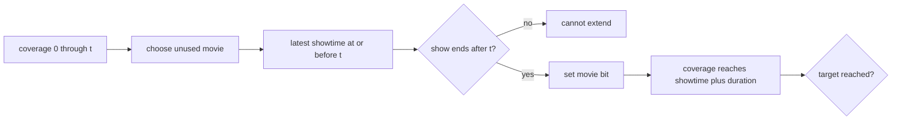

# Moovie Mooving

- Source: USACO January 2015 Gold
- USACO Guide ID: `usaco-515`
- Difficulty at selection: Easy (checked in [Guide source commit 1f63a5e](https://github.com/cpinitiative/usaco-guide/blob/1f63a5eea89f25ee8e71178d1596b92f0b87bb46/content/4_Gold/DP_Bitmasks.problems.json))
- Original problem: [Moovie Mooving](https://www.usaco.org/index.php?page=viewproblem2&cpid=515)
- Tags: Bitmask DP, Binary Search, Scheduling
- Solution: [C++](../../solutions/usaco-515.cpp)

## Problem Summary

Bessie wants to watch movies continuously from time zero until at least a target time. Each movie has one duration and several showtimes. She may enter a showing after it begins, leave before it ends, and use each movie at most once. Find the fewest distinct movies needed, or report that continuous coverage is impossible.

This summary is paraphrased for study. Refer to the official problem for the complete statement and constraints.

## Visualization Description

Draw every showing as an interval on a timeline. A DP state owns a solid colored bar from time zero through `covered_until[mask]`. To add an unused movie, locate the latest showing that starts at or before the end of that bar. If the showing is still running, its ending extends the solid bar without creating a gap.

## Approach

Let `covered_until[mask]` be the latest time reachable with uninterrupted viewing from time zero after using exactly the movies in `mask`. Initialize the empty mask to time zero and all other states as unreachable. From a reachable state ending at time `t`, try every unused movie. Binary-search its sorted showtimes for the latest start not after `t`. If that showing ends after `t`, update the larger mask with its ending time.

Keeping only the farthest time for each subset is safe: any future showing available from an earlier covered time is also enterable from the later time if it is still useful, and a later endpoint never gives worse coverage. Among states reaching the target, the smallest set-bit count is the answer.

## Correctness

The empty state exactly represents continuous coverage through time zero. Suppose a state stores the farthest time achievable by its movie subset. Any valid next movie must have a showing that begins no later than the current endpoint and ends afterward; otherwise there is a gap or no extension. The transition chooses the latest start not after the endpoint, which has the latest end because all showings of one movie share a duration. Therefore it finds the best extension using that movie. Every valid viewing schedule corresponds to a sequence of these transitions, and every transition preserves continuous coverage. By induction, each state stores its exact farthest endpoint. Minimizing the population count of target-reaching masks therefore gives the minimum number of movies.

## Complexity

- Time: `O(N * 2^N * log C)`, where `C` is the largest showing count
- Space: `O(2^N)` besides the input schedules

## Verification

The smoke test uses the official sample. The independent verifier explores all valid movie orders and showing choices for small random schedules, then compares the minimum distinct-movie count. It also covers one-movie success, no showing at time zero, joining a showing late, exact endpoint handoffs, impossible gaps, and a full `N=20` chain.
