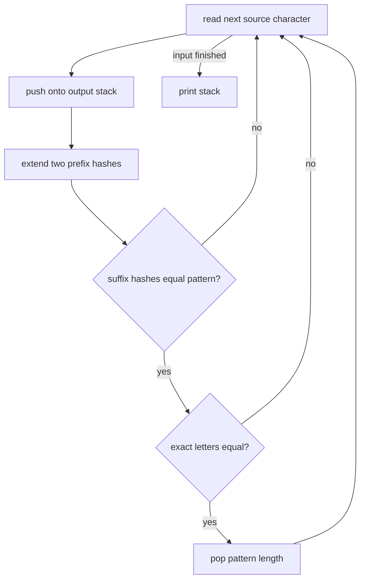

# Censoring

- Source: USACO Silver
- USACO Guide ID: `usaco-529`
- Difficulty at selection: Easy (checked in [Guide source commit ff59fe9](https://github.com/cpinitiative/usaco-guide/blob/ff59fe9483c6e72b738d607950bf6634455bd8db/content/4_Gold/Hashing.problems.json))
- Original problem: [USACO 2015 February Silver — Censoring](https://usaco.org/index.php?cpid=529&page=viewproblem2)
- Tags: Rolling Hash, Stack, Strings
- Solution: [C++](../../solutions/usaco-529.cpp)

## Problem Summary

Repeatedly remove the earliest occurrence of one forbidden word from a long lowercase string. A deletion can join previously separated characters and create another occurrence. Output the text that remains after no occurrence is left.

This is a paraphrased study summary. Refer to the official page for the complete statement and constraints.

## Visualization Description

Imagine typing the source into an output tray one character at a time. The part already in the tray is safe except possibly for its newest suffix. Two prefix-hash rulers sit below the tray. When the final `|T|` characters match the forbidden word's fingerprints and exact letters, that suffix is popped from the tray, exposing the earlier boundary for future characters.

## Approach

Build the final text from left to right in a string used as a stack. Appending one character cannot change any occurrence wholly before the new character; the only possible new forbidden occurrence is the suffix ending at that character.

Keep two polynomial prefix hashes alongside the stack. They test that suffix in constant time. If both hashes match, compare the actual suffix bytes as a collision-proof guard, then resize the text and prefix arrays to delete it. True exact comparisons cost linear time in total because every successfully compared character is immediately removed.

## Correctness

After processing each source prefix, the stack equals the result of fully censoring that prefix. This is true initially. On an append, every old part of the stack was already free of the forbidden word, so only the new suffix can violate the invariant. If it is not the forbidden word, the stack is fully censored. If it is, deleting that suffix performs exactly the required next removal; the remaining prefix was already safe. Induction proves the final stack is the required censored text.

The exact comparison after the double-hash filter means a collision can never cause a wrong deletion.

## Complexity

- Expected time: `O(|S| + |T|)`
- Space: `O(|S|)`

## Verification

The smoke test uses the official sample. The independent verifier repeatedly performs literal leftmost deletion on random small strings and compares that oracle with the stack solution; it also checks long overlap-heavy inputs.
