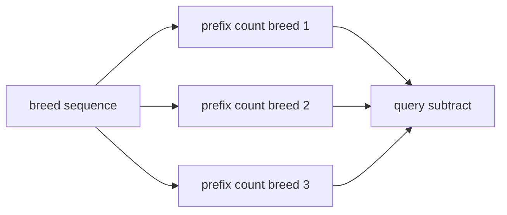

# Breed Counting

- Source: Silver
- USACO Guide ID: `usaco-572`
- Original problem: [http://www.usaco.org/index.php?page=viewproblem2&cpid=572](http://www.usaco.org/index.php?page=viewproblem2&cpid=572)
- Tags: Prefix Sums
- Solution: [`../../solutions/usaco-572.cpp`](../../solutions/usaco-572.cpp)

## Problem Summary

For many intervals, report how many cows of each of three breeds appear.

This is a paraphrase for study notes. Use the original problem link for the official statement, constraints, and judge-specific details.

## Visualization Description

Each breed has its own cumulative counter line; an interval answer is the rise between two x-positions.

## Approach

Maintain three prefix-count arrays. For query [l, r], subtract counts before l from counts through r for each breed. The query work is constant because the number of breeds is fixed.

## Correctness Notes

The solution keeps the invariant described in the approach and updates only the state that can affect future answers. For query-style problems, preprocessing stores exactly the aggregate needed to answer each query. For graph and tree problems, each selected data structure operation mirrors one allowed change in the represented structure.

## Complexity

See the comments and structure of the C++ solution for the exact loop/data-structure cost. The intended complexity is efficient for the official constraints of the linked problem.

## Verification

Checked singleton intervals and full-range totals.
