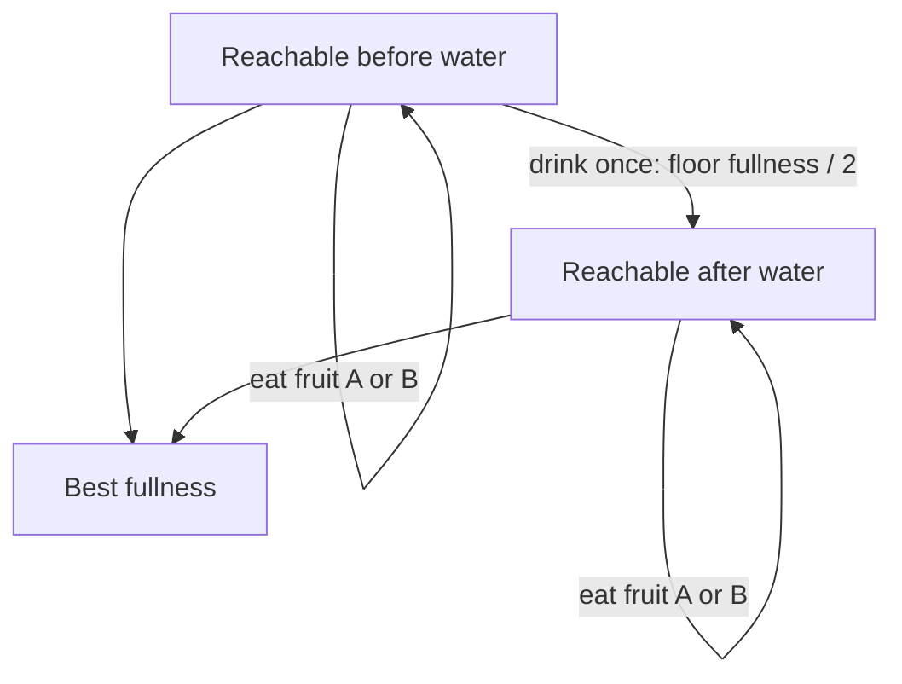

# Fruit Feast

- Source: USACO Gold
- USACO Guide ID: `usaco-574`
- Difficulty at selection: Easy (checked in [Guide source commit 8671909](https://github.com/cpinitiative/usaco-guide/blob/86719090e74da7a51af284038c0a7ebf6636ce8e/content/4_Gold/Knapsack_DP.problems.json))
- Original problem: [Fruit Feast](https://usaco.org/index.php?page=viewproblem2&cpid=574)
- Tags: Dynamic Programming, Knapsack, Reachability
- Solution: [C++](../../solutions/usaco-574.cpp)

## Problem Summary

Bessie repeatedly eats either of two fruit types without exceeding a fullness limit. At most once, she may drink water and halve her current fullness, rounding down. Find the greatest fullness she can reach.

This summary is paraphrased for study. Refer to the official problem for complete rules and constraints.

## Visualization Description

Draw two horizontal number lines from zero to T. The top line represents states before drinking and the bottom represents states after drinking. Fruit arrows move right by A or B on either line. Each reachable top point has one diagonal arrow to floor(x/2) on the bottom. The bottom has no arrows back up or downward, making the one-drink rule visible.

## Approach

Use two byte arrays indexed by fullness. First mark all values reachable with unlimited fruit before drinking, scanning upward so newly reached states can eat again. Every such value x seeds `after[floor(x/2)]`. Then scan the after array upward and add fruits there. The answer is the largest marked value in either array.

## Correctness

Before drinking, every legal history is a sequence of A/B additions, exactly what the first upward closure generates. Drinking from every such state adds precisely every possible post-drink starting value. Afterward, legal histories contain only more A/B additions, exactly what the second closure generates. No second halving edge exists. Conversely, each generated transition is a legal action and bounds are checked, so neither layer contains an impossible state. The union is therefore exactly all legal final fullness values, and its maximum is the required answer.

## Complexity

Each fullness position is processed once per layer. Time is O(T), and space is O(T), using about two bytes per position.

## Verification

The official sample is smoke-tested. An independent graph-search oracle explores states `(fullness, drank)` for exhaustive small limits and random cases. Tests cover T=1, equal fruits, optional water, rounding down, the USACO file interface, and T=5,000,000.
