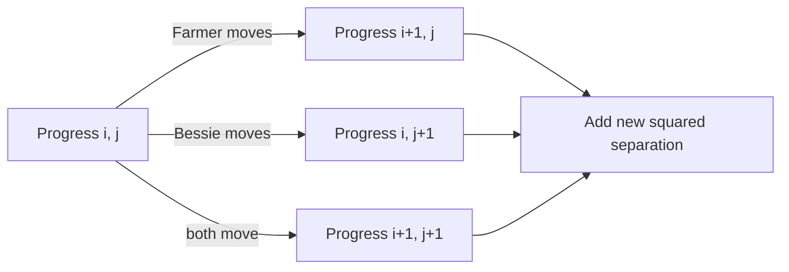

# Radio Contact

- Source: USACO Gold, January 2016
- USACO Guide ID: `usaco-598`
- Difficulty at selection: Easy (checked in [Guide source commit ecd27b6](https://github.com/cpinitiative/usaco-guide/blob/ecd27b6eff69112891eabf0c968d3ad0b2a7f745/content/4_Gold/Paths_Grids.problems.json))
- Original problem: [USACO — Radio Contact](https://www.usaco.org/index.php?page=viewproblem2&cpid=598)
- Tags: Dynamic Programming, Grid Paths
- Solution: [C++](../../solutions/usaco-598.cpp)

## Problem Summary

Farmer John and Bessie each have a fixed walking route. At a time step, either traveler or both travelers may advance by the next move on their own route. After every non-start time step, the radios spend energy equal to the squared distance between their current positions. Find the scheduling of moves that finishes both routes with minimum total energy.

This summary is paraphrased for study. Refer to the official problem for the complete statement and constraints.

## Visualization Description

Plot a grid of progress pairs `(i,j)`, where `i` is Farmer John's completed steps and `j` is Bessie's. From a cell, a vertical edge advances only Farmer John, a horizontal edge advances only Bessie, and a diagonal edge advances both. The destination cell reached by each edge is labeled with the squared distance between their new positions. The answer is the shortest weighted path from `(0,0)` to `(N,M)`.

## Approach

First build every position along both fixed paths. Let `dp[i][j]` be the minimum energy after Farmer John has taken `i` route steps and Bessie has taken `j`. The preceding time step can be `(i-1,j)`, `(i,j-1)`, or `(i-1,j-1)`, corresponding to Farmer moving, Bessie moving, or both moving. Take the cheapest predecessor and add the squared distance at positions `(i,j)`. The initial state costs zero because the statement excludes the starting instant. The implementation rolls two rows for `O(M)` memory.

## Correctness

Every legal schedule ending at progress `(i,j)` has exactly one of three final actions: only Farmer moves, only Bessie moves, or both move. Removing that final action produces the corresponding predecessor state, and the energy added at the last time step is precisely the squared separation at `(i,j)`. The recurrence checks all three exhaustive possibilities and selects the cheapest. Its transitions also create only legal schedules that advance each route in order. Starting from zero energy at `(0,0)`, induction over increasing `i+j` proves every DP value is optimal, especially `dp[N][M]`.

## Complexity

- Time: `O(NM)`
- Space: `O(M)` for the DP plus `O(N+M)` stored positions

## Verification

The official sample is smoke-tested. An independent exhaustive scheduler explores all one-person and two-person move choices for short paths and directly sums their costs. Tests include coincident routes, waiting-heavy optima, every direction, maximum path lengths, and the original `radio.in`/`radio.out` interface.
