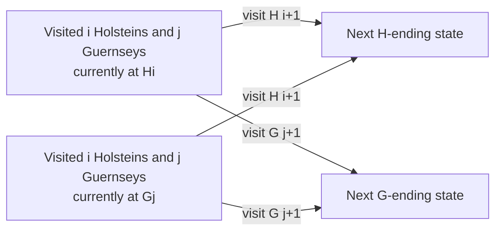

# Cow Checklist

- Source: USACO Gold, December 2016
- USACO Guide ID: `usaco-670`
- Difficulty at selection: Easy (checked in [Guide source commit ecd27b6](https://github.com/cpinitiative/usaco-guide/blob/ecd27b6eff69112891eabf0c968d3ad0b2a7f745/content/4_Gold/Paths_Grids.problems.json))
- Original problem: [USACO — Cow Checklist](https://www.usaco.org/index.php?page=viewproblem2&cpid=670)
- Tags: Dynamic Programming, Grid Paths, Interleaving
- Solution: [C++](../../solutions/usaco-670.cpp)

## Problem Summary

Farmer John must visit two numbered breeds of cows. Within each breed, visits must follow increasing number order, but the two ordered lists may be interleaved. He starts at the first Holstein, must finish at the last Holstein, and pays the squared Euclidean distance for every move. Find the least total energy that visits every cow.

This summary is paraphrased for study. Refer to the official problem for the complete statement and constraints.

## Visualization Description

Draw a grid whose horizontal coordinate is the number of Guernseys already visited and whose vertical coordinate is the number of Holsteins already visited. Each grid location has two layers: one says the route currently ends at the newest Holstein, and the other says it ends at the newest Guernsey. Moving down visits the next Holstein; moving right visits the next Guernsey. Color each edge with the squared distance between its endpoint cows, and highlight the cheapest path from `(1,0,H)` to `(H,G,H)`.

## Approach

Use two DP tables. `end_at_h[i][j]` is the minimum energy after visiting the first `i` Holsteins and `j` Guernseys and standing at Holstein `i`; `end_at_g[i][j]` is defined similarly for Guernsey `j`. Start only at `end_at_h[1][0] = 0`. From either endpoint type, visit the next cow of either breed and add the squared distance. The answer is specifically `end_at_h[H][G]`, which enforces the required final Holstein.

## Correctness

Every valid partial tour is identified by three facts: how many Holsteins were visited, how many Guernseys were visited, and which breed supplied its current final cow. The next legal visit must be either the next Holstein or the next Guernsey, so the transitions enumerate every allowed continuation and preserve both breed orders. Conversely, every transition appends exactly the next unseen cow of one breed and is therefore legal. Each state stores the minimum over all possible preceding states, so induction on `i+j` proves it contains the least energy for its definition. The final H-ending state has visited all cows and ends at the required Holstein, making it the optimal complete tour.

## Complexity

- Time: `O(HG)`
- Space: `O(HG)`

## Verification

The official sample is smoke-tested. An independent oracle enumerates every valid breed-label interleaving for small herds, computes each full tour directly, and compares its minimum with the program. Additional cases cover repeated coordinates, one cow in a breed, expensive breed switches, maximum sizes, and the official file interface.
