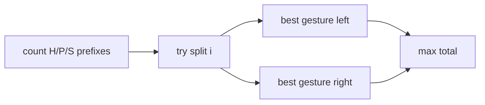

# Hoof Paper Scissors

- Source: Silver
- USACO Guide ID: `usaco-691`
- Original problem: [http://www.usaco.org/index.php?page=viewproblem2&cpid=691](http://www.usaco.org/index.php?page=viewproblem2&cpid=691)
- Tags: Prefix Sums
- Solution: [`../../solutions/usaco-691.cpp`](../../solutions/usaco-691.cpp)

## Problem Summary

Choose one gesture before a switch point and another gesture after it to maximize wins against a known sequence.

This is a paraphrase for study notes. Use the original problem link for the official statement, constraints, and judge-specific details.

## Visualization Description

Imagine a vertical cut through the games. Left of the cut gets one best gesture; right of the cut gets another.

## Approach

For a fixed interval, the best gesture is determined only by how many H, P, and S appear there. Prefix counts let us evaluate every split in O(1): best wins in the prefix plus best wins in the suffix.

## Correctness Notes

The solution keeps the invariant described in the approach and updates only the state that can affect future answers. For query-style problems, preprocessing stores exactly the aggregate needed to answer each query. For graph and tree problems, each selected data structure operation mirrors one allowed change in the represented structure.

## Complexity

See the comments and structure of the C++ solution for the exact loop/data-structure cost. The intended complexity is efficient for the official constraints of the linked problem.

## Verification

Checked no switch, switch at ends, and sequences dominated by each gesture.
