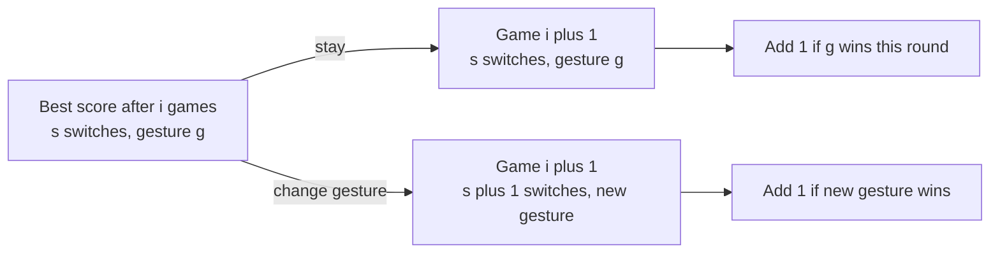

# Hoof, Paper, Scissors

- Source: USACO Gold, January 2017
- USACO Guide ID: `usaco-694`
- Difficulty at selection: Easy
- Original problem: [USACO — Hoof, Paper, Scissors](https://www.usaco.org/index.php?page=viewproblem2&cpid=694)
- Tags: Dynamic Programming
- Solution: [`../../solutions/usaco-694.cpp`](../../solutions/usaco-694.cpp)

## Problem Summary

Bessie knows Farmer John's gesture in each of `N` rounds. She may choose any initial gesture, but she may change gestures at most `K` times across the whole match. Find the largest number of rounds she can win.

This summary is paraphrased for study. Use the official link for the full statement and constraints.

## Visualization Description

Draw one row per round and three columns for Bessie's current gesture. Stack `K + 1` copies of that grid, one for each number of switches used. A horizontal edge stays in the same gesture column and costs no switch; a diagonal edge moves to another gesture column in the next switch layer. Each visited cell adds one point exactly when its gesture beats that round's opponent move.

## Approach

Let `dp[s][g]` be the best score after the processed prefix using exactly `s` changes and currently playing gesture `g`. For the next game, Bessie either keeps `g`, or—when `s > 0`—arrives from either other gesture with `s - 1` previous changes. Add one if the chosen gesture wins the new round.

All three initial gestures are available with zero changes. After the final round, take the maximum over every gesture and every switch count from `0` through `K`. Only the previous round is needed, so the implementation rolls two `O(K)` tables.

## Correctness

We prove by induction on the number of processed rounds that `dp[s][g]` equals the maximum wins among all strategies that use exactly `s` switches and end with gesture `g`. Before any round, each initial gesture is reachable with zero switches and zero wins, while all positive-switch states are impossible. For the next round, every valid strategy ending in `(s, g)` either also used `g` in the preceding round, or switched from one of the other two gestures and previously used `s - 1` switches. The transition checks exactly these exhaustive, disjoint possibilities and keeps their best score, then adds the correct win value for the current round. Thus the invariant continues to hold. The maximum over all final states with `s <= K` is therefore the best legal match score.

## Complexity

- Time: `O(NK)` because the number of gestures is the constant three
- Space: `O(K)` with rolling DP rows

## Verification

The smoke test uses the official sample. The independent verifier exhaustively enumerates all `3^N` gesture sequences for many short matches, rejects sequences with too many changes, and compares the best remaining score with the C++ program.
