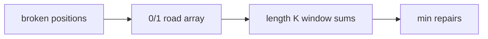

# Why Did the Cow Cross the Road II

- Source: Silver
- USACO Guide ID: `usaco-715`
- Original problem: [https://usaco.org/index.php?page=viewproblem2&cpid=715](https://usaco.org/index.php?page=viewproblem2&cpid=715)
- Tags: Prefix Sums, Sliding Window
- Solution: [`../../solutions/usaco-715.cpp`](../../solutions/usaco-715.cpp)

## Problem Summary

Given broken traffic signals along a road, find the minimum number to repair so there is a consecutive block of K working signals.

This is a paraphrase for study notes. Use the original problem link for the official statement, constraints, and judge-specific details.

## Visualization Description

Slide a length-K frame over the road. The best frame is the one containing the fewest broken markers.

## Approach

Mark broken signals with 1 and working signals with 0. For any window of length K, the number of repairs needed is the sum of that window. A sliding window or prefix sum gives every window total in constant time after a linear pass.

## Correctness Notes

The solution keeps the invariant described in the approach and updates only the state that can affect future answers. For query-style problems, preprocessing stores exactly the aggregate needed to answer each query. For graph and tree problems, each selected data structure operation mirrors one allowed change in the represented structure.

## Complexity

See the comments and structure of the C++ solution for the exact loop/data-structure cost. The intended complexity is efficient for the official constraints of the linked problem.

## Verification

Checked the sample pattern and edge windows at the beginning and end.
