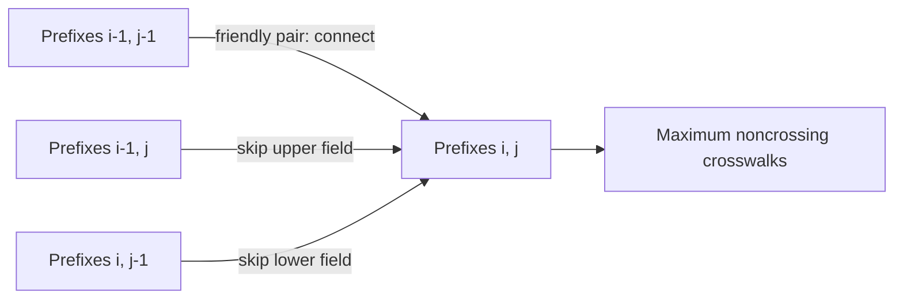

# Why Did the Cow Cross the Road II

- Source: USACO Gold, February 2017
- USACO Guide ID: `usaco-718`
- Difficulty at selection: Easy (checked in [Guide source commit ecd27b6](https://github.com/cpinitiative/usaco-guide/blob/ecd27b6eff69112891eabf0c968d3ad0b2a7f745/content/4_Gold/Paths_Grids.problems.json))
- Original problem: [USACO — Why Did the Cow Cross the Road II](https://www.usaco.org/index.php?page=viewproblem2&cpid=718)
- Tags: Dynamic Programming, Grid Paths, Longest Common Subsequence
- Solution: [C++](../../solutions/usaco-718.cpp)

## Problem Summary

Two sides of a road each contain the same `N` breed IDs in possibly different orders. A crosswalk may join two positions when their IDs differ by at most four. Every position may be used once, and drawn crosswalks may not intersect. Find the largest legal collection.

This summary is paraphrased for study. Refer to the official problem for the full statement and constraints.

## Visualization Description

Place the first ordering along the left edge and the second along the top edge of an `N × N` grid. Cell `(i,j)` is a possible crosswalk when the two IDs are friendly. Moving down or right skips a field; moving diagonally through a friendly cell selects that crosswalk. Because both indices increase, selected diagonal steps can never cross.

## Approach

Let `dp[i][j]` be the maximum number of crosswalks using only the first `i` fields on one side and first `j` fields on the other. We may skip either newest field, giving `dp[i-1][j]` or `dp[i][j-1]`. If the newest pair is friendly, connect it after an optimal solution on both smaller prefixes, giving `dp[i-1][j-1] + 1`. Take the maximum. Only two rows are needed.

## Correctness

Consider an optimal solution for prefixes `(i,j)`. If it does not use upper field `i`, it is counted by `dp[i-1][j]`; if it does not use lower field `j`, it is counted by `dp[i][j-1]`. Otherwise those two newest fields are connected to each other: their IDs must be friendly, and removing that crosswalk leaves a valid noncrossing solution for `(i-1,j-1)`. The recurrence checks all cases. Conversely, skipping a field preserves validity, and adding a friendly newest pair to smaller prefixes cannot cross an earlier connection. Induction over the prefix sizes proves the DP optimum, including `dp[N][N]`.

## Complexity

- Time: `O(N²)`
- Space: `O(N)`

## Verification

The official sample is smoke-tested. An independent exhaustive matcher tries every increasing sequence of friendly pairs on small permutations. Tests cover identical and reversed orders, the friendliness boundary at distance four, maximum `N`, and the official `nocross.in`/`nocross.out` interface.
