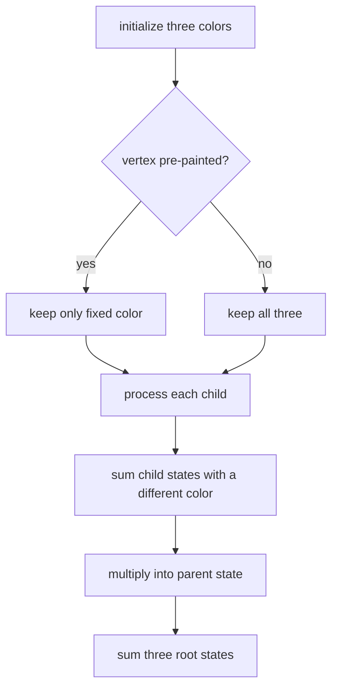

# Barn Painting

- Source: USACO December 2017 Gold
- USACO Guide ID: `usaco-766`
- Difficulty at selection: Easy (checked in [Guide source commit ed367e8](https://github.com/cpinitiative/usaco-guide/blob/ed367e8953e137e603d09a36fd7040dcf2e30667/content/4_Gold/DP_Trees.problems.json))
- Original problem: [USACO Barn Painting](https://www.usaco.org/index.php?page=viewproblem2&cpid=766)
- Tags: Tree DP, Coloring
- Solution: [C++](../../solutions/usaco-766.cpp)

## Problem Summary

Assign one of three colors to every vertex in a tree. Adjacent vertices need different colors, and some vertices already have fixed colors. Count the valid completions modulo `1,000,000,007`.

This is a paraphrased study summary. Refer to the official page for the complete statement and constraints.

## Visualization Description

Show three paint buckets beside each rooted vertex. A fixed barn has two crossed-out buckets. For a parent using red, its child may contribute the blue and green totals but not red. Each child branch is independent, so their allowed sums multiply.

## Approach

Let `ways[v][c]` count valid paintings of `v`'s subtree when `v` uses color `c`. Initialize all three entries to one, except a fixed vertex gets one only at its required color. For each child and parent color `c`, multiply by the sum of the child's two states whose colors differ from `c`. Use an iterative rooted traversal in reverse order and finally sum the root's three states.

## Correctness

The initialization permits exactly the colors consistent with every fixed barn. Once `v` has color `c`, a child may use exactly the other two colors; the transition sums precisely those valid child states. Separate child subtrees share only `v`, so multiplying forms each compatible combination exactly once. Induction from leaves proves every DP entry correct, and summing all root colors gives exactly all valid complete paintings.

## Complexity

- Time: `O(N)`
- Space: `O(N)`

## Verification

The smoke test uses the official sample. The independent verifier enumerates all `3^N` paintings of small random trees, filters fixed-color and edge constraints directly, and compares the count. It also checks no fixed barns, contradictory adjacent fixed colors, one vertex, stars, paths, and a maximum-length chain.
