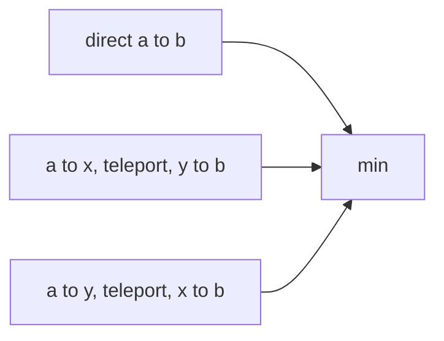

# Teleportation

- Source: Bronze
- USACO Guide ID: `usaco-807`
- Original problem: [http://www.usaco.org/index.php?page=viewproblem2&cpid=807](http://www.usaco.org/index.php?page=viewproblem2&cpid=807)
- Tags: Math
- Solution: [`../../solutions/usaco-807.cpp`](../../solutions/usaco-807.cpp)

## Problem Summary

Move from a to b either directly or by using one bidirectional teleporter with endpoints x and y.

This is a paraphrase for study notes. Use the original problem link for the official statement, constraints, and judge-specific details.

## Visualization Description

Place the four points on a number line. The teleporter folds x and y together, so compare the straight walk with the two possible ways to reach that fold.

## Approach

There are only three meaningful routes: direct, enter at x and leave at y, or enter at y and leave at x. Taking any extra walking around the teleporter cannot help, so the answer is the minimum of those three distances.

## Correctness Notes

The solution keeps the invariant described in the approach and updates only the state that can affect future answers. For query-style problems, preprocessing stores exactly the aggregate needed to answer each query. For graph and tree problems, each selected data structure operation mirrors one allowed change in the represented structure.

## Complexity

See the comments and structure of the C++ solution for the exact loop/data-structure cost. The intended complexity is efficient for the official constraints of the linked problem.

## Verification

Checked cases where the teleporter helps, hurts, and has reversed endpoint order.
