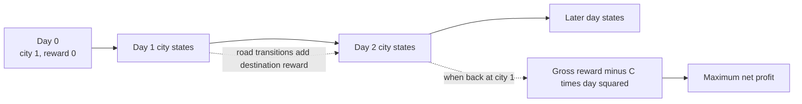

# Time is Mooney

- Source: USACO Gold, January 2020
- USACO Guide ID: `usaco-993`
- Difficulty at selection: Easy
- Original problem: [USACO — Time is Mooney](https://www.usaco.org/index.php?page=viewproblem2&cpid=993)
- Tags: Dynamic Programming, Directed Graphs
- Solution: [`../../solutions/usaco-993.cpp`](../../solutions/usaco-993.cpp)

## Problem Summary

Bessie starts in city 1 of a directed graph. Entering a city earns its listed reward, every road takes one day, and a trip lasting `T` days pays a quadratic cost `C * T^2`. She must finish back at city 1 and may also take a zero-day trip. Find her greatest possible net profit.

This summary is paraphrased for study. Use the official link for the full statement and constraints.

## Visualization Description

Unroll the graph into layers of time. Layer `t` contains one copy of every city, and each directed road becomes an edge from its start in layer `t` to its destination in layer `t + 1`. Dynamic programming finds the greatest gross reward at every layered node. Whenever city 1 is reachable in a layer, subtract that layer's quadratic trip cost.

## Approach

Let `dp[t][v]` be the maximum gross reward of any `t`-day walk that starts at city 1 and ends at city `v`. Start with `dp[0][1] = 0`. For every directed road `u -> v`, a reachable state on day `t` can update day `t + 1` with `dp[t][u] + reward[v]`. After each day, if city 1 is reachable, use `dp[t][1] - C*t^2` as a candidate answer.

Rewards are at most 1000 per day and `C >= 1`. Therefore any `t`-day trip earns at most `1000t - t^2` net, which is negative once `t > 1000`. Checking through day 1000 is sufficient. Rolling the day layers avoids storing the whole time-expanded graph.

## Correctness

Induct on `t`. The day-zero state correctly represents the only zero-day walk. Assume the DP values for day `t` are the best gross rewards for their endpoints. Every `(t + 1)`-day walk has a unique final road `u -> v`; its earlier prefix is a `t`-day walk ending at `u`. The transition considers that road and, by the induction hypothesis, combines it with the best possible prefix reward. Conversely, every transition appends a real road and creates a valid walk. Hence each new DP value is optimal. A legal trip is exactly a represented walk whose endpoint is city 1, so evaluating every such state and subtracting its duration cost finds the best trip among all checked durations. No longer trip can beat the zero-profit stay-home option by the 1000-day bound, so the reported maximum is globally optimal.

## Complexity

- Time: `O(1000M)`
- Space: `O(N + M)` including the road list and two DP layers

## Verification

The smoke test uses the official sample. The independent verifier generates small random directed graphs and compares the solution against a separate exact-day DP oracle over a bounded reward range. Additional deterministic cases cover no return path, staying home, and repeated profitable cycles.
