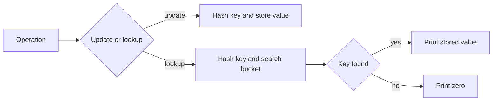

# Associative Array

- Source: Library Checker (YS)
- USACO Guide ID: `ys-AssociativeArray`
- Difficulty at selection: Easy
- Original problem: [https://judge.yosupo.jp/problem/associative_array](https://judge.yosupo.jp/problem/associative_array)
- Tags: Map, Hashing
- Solution: [`../../solutions/ys-AssociativeArray.cpp`](../../solutions/ys-AssociativeArray.cpp)

## Problem Summary

Maintain values at very large integer keys. An update assigns a value to one key; a lookup prints that key's value, using zero for keys never assigned.

This is a paraphrase for study notes. Use the original link for the official statement and constraints.

## Visualization Description

The conceptual array is enormous but almost every location is still zero. Store only the written locations as key-value cards in hash buckets instead of allocating the empty range.

## Approach

Use an `unordered_map` from 64-bit key to 64-bit value. Assignment replaces the stored value for a key. Lookup uses `find`, which avoids inserting absent keys, and prints zero when the key is missing. A SplitMix64-based hash makes deliberately clustered inputs much less likely to degrade performance.

## Correctness

Maintain the invariant that the map contains exactly the keys that have been assigned, paired with their latest values. An update establishes the invariant for its key without changing any other key. For a lookup, a present key returns its latest assignment by the invariant; an absent key has never been assigned and therefore still has the required default value zero. Thus every printed answer is correct.

## Complexity

- Expected time: `O(Q)` total, `O(1)` expected per operation
- Extra space: `O(U)`, where `U` is the number of distinct updated keys

## Verification

The smoke test checks missing keys, overwrites, stored zero, the largest allowed key, and independent keys.
