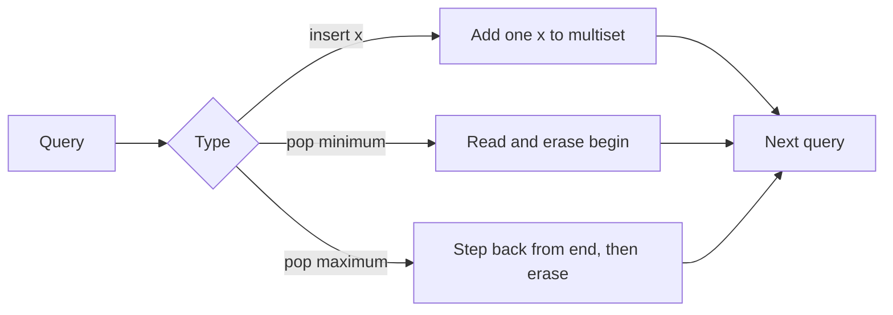

# Double-Ended Priority Queue

- Source: Library Checker (YS)
- USACO Guide ID: `ys-DEPQ`
- Difficulty at selection: Easy
- Original problem: [https://judge.yosupo.jp/problem/double_ended_priority_queue](https://judge.yosupo.jp/problem/double_ended_priority_queue)
- Tags: Data Structures, Multiset, Priority Queue
- Solution: [`../../solutions/ys-DEPQ.cpp`](../../solutions/ys-DEPQ.cpp)

## Problem Summary

Maintain a collection that allows duplicates. Queries either insert a number, remove and print one smallest number, or remove and print one largest number. Removal queries are guaranteed to occur only when the collection is nonempty.

This is a paraphrase for study notes. Use the original link for the official statement and constraints.

## Visualization Description

Picture the values on an automatically sorted shelf. Insertions slide a value into order. A minimum removal takes the leftmost copy, while a maximum removal takes the rightmost copy. Equal numbers occupy separate slots, so removing one does not erase every copy.

## Approach

Use C++ `multiset<int>`, a balanced ordered tree that stores duplicate keys. Insertion is direct. `begin()` points to one minimum element. The `end()` iterator is one step past the data, so `prev(end())` points to one maximum element. Erasing by iterator removes exactly that occurrence.

## Correctness

Initially, inserting every input value makes the multiset contain exactly the starting collection, including duplicates. An insertion query adds exactly one requested value. Because the multiset is ordered, `begin()` is a minimum and `prev(end())` is a maximum; printing and erasing that iterator performs the corresponding removal exactly once. Each operation preserves equality between the multiset and the problem's collection, so every printed answer is correct.

## Complexity

- Initial construction: `O(N log N)`
- Each query: `O(log(N + Q))`
- Extra space: `O(N + Q)` in the worst case

## Verification

The smoke test uses the official operation pattern with duplicate maximum values and both negative and positive insertions. Additional randomized verification compares outputs with a small sorted vector model.
