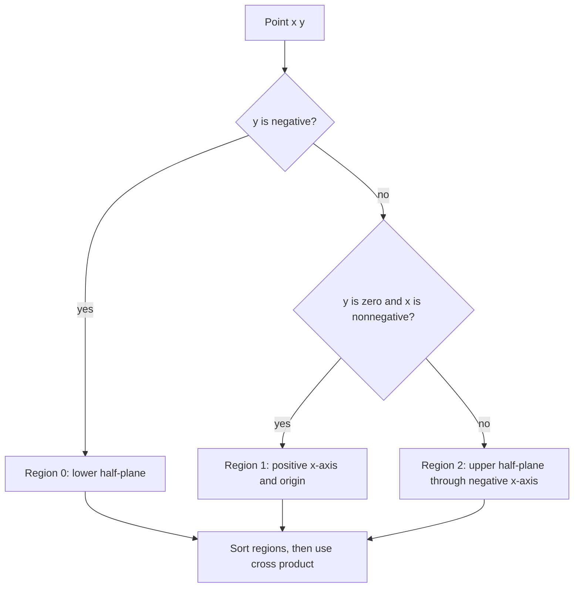

# Sort Points by Argument

- Source: Library Checker (YS)
- USACO Guide ID: `ys-SortPointsByArgument`
- Difficulty at selection: Easy
- Original problem: [https://judge.yosupo.jp/problem/sort_points_by_argument](https://judge.yosupo.jp/problem/sort_points_by_argument)
- Tags: Geometry, Sorting, Cross Product
- Solution: [`../../solutions/ys-SortPointsByArgument.cpp`](../../solutions/ys-SortPointsByArgument.cpp)

## Problem Summary

Sort integer-coordinate points by their direction from the origin, moving counterclockwise from the negative x-axis. Points on the same ray may appear in any order, and the origin is treated as having angle zero.

This is a paraphrase for study notes. Use the original link for the official statement and constraints.

## Visualization Description

Draw rays from the origin to every point. First divide the plane into three consecutive regions: the lower half-plane, the nonnegative x-axis, and everything above that axis through the negative x-axis. Within one region, the sign of the cross product tells which ray comes first counterclockwise.

## Approach

Assign each point a region matching the required circular starting point. Sort by region first. When two points share a region, compute `a.x * b.y - a.y * b.x`. A positive result means rotating counterclockwise from `a` reaches `b`, so `a` comes first. A zero result means the directions match and the stable sort may retain either allowed order.

All products use signed 64-bit integers. With coordinate magnitudes at most `10^9`, the cross product remains within that type's range, avoiding floating-point precision errors.

## Correctness

The three regions appear in exactly the required counterclockwise order beginning just after the negative x-axis. Points from different regions are therefore ordered correctly by their region numbers. Within one region, the angular separation is less than 180 degrees, so the cross product is positive exactly when the first point's direction comes before the second counterclockwise. Thus every pair of distinct directions is ordered by angle. Equal directions compare equal, which is permitted, so the final sequence is valid.

## Complexity

- Time: `O(N log N)`
- Extra space: `O(N)` for the sorting implementation and input array

## Verification

The smoke test uses the four axes plus the origin. Randomized verification checks the integer comparator against high-precision `atan2` ordering for small coordinate sets and explicitly covers duplicate rays.
