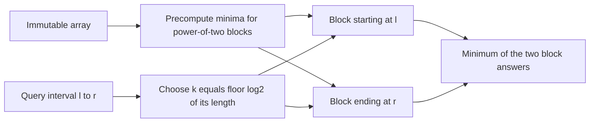

# Static RMQ

- Source: Library Checker (YS)
- USACO Guide ID: `ys-StaticRMQ`
- Difficulty at selection: Easy
- Original problem: [https://judge.yosupo.jp/problem/staticrmq](https://judge.yosupo.jp/problem/staticrmq)
- Tags: Range Minimum Query, Sparse Table
- Solution: [`../../solutions/ys-StaticRMQ.cpp`](../../solutions/ys-StaticRMQ.cpp)

## Problem Summary

An array never changes. For every half-open interval `[l, r)`, report the smallest value inside that interval.

This is a paraphrase for study notes. Use the original link for the official statement and constraints.

## Visualization Description

Think of the array as being covered by reusable blocks whose lengths are powers of two. Level zero stores blocks of length one, level one stores length two, and so on. Any query interval can be covered by two blocks of the same largest power-of-two length. The blocks may overlap because taking a minimum twice does not change it.

## Approach

Build a sparse table where `minimum[k][i]` is the minimum of the `2^k` values beginning at index `i`. Level zero is the original array. A block at level `k` is the minimum of two adjacent blocks at level `k - 1`.

For a query `[l, r)`, set `k = floor(log2(r - l))`. Read one length-`2^k` block starting at `l` and another ending at `r`. These blocks cover the interval, possibly with overlap, so their minimum is the query answer.

## Correctness

The preprocessing recurrence is correct by induction on `k`: level zero stores each one-element minimum, and joining the two correct halves gives the minimum of the full `2^k` block. For a query, the chosen left and right blocks lie inside `[l, r)` and together cover it because each is longer than half the query length. Every query value therefore appears in at least one block, and neither block includes an outside value. Taking their minimum returns exactly the minimum of `[l, r)`.

## Complexity

- Preprocessing time: `O(N log N)`
- Query time: `O(1)`
- Extra space: `O(N log N)`

## Verification

The smoke test covers single-value, overlapping, and full-array queries. Additional randomized verification compares every query against a direct scan on many small arrays.
