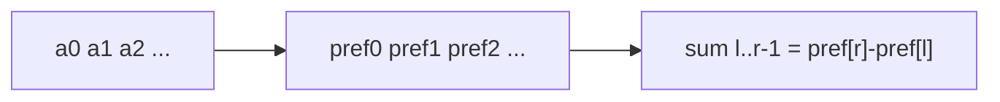

# Static Range Sum

- Source: YS
- USACO Guide ID: `ys-StaticRangeSum`
- Original problem: [https://judge.yosupo.jp/problem/static_range_sum](https://judge.yosupo.jp/problem/static_range_sum)
- Tags: Prefix Sums
- Solution: [`../../solutions/ys-StaticRangeSum.cpp`](../../solutions/ys-StaticRangeSum.cpp)

## Problem Summary

Answer many range sum queries on an immutable array.

This is a paraphrase for study notes. Use the original problem link for the official statement, constraints, and judge-specific details.

## Visualization Description

The prefix array is a ruler of cumulative sums; a query cuts out the segment between two tick marks.

## Approach

Because the array never changes, we can precompute pref[i] as the sum of the first i values. The sum on the half-open interval [l, r) is pref[r] - pref[l]. This moves all repeated work into one linear preprocessing pass.

## Correctness Notes

The solution keeps the invariant described in the approach and updates only the state that can affect future answers. For query-style problems, preprocessing stores exactly the aggregate needed to answer each query. For graph and tree problems, each selected data structure operation mirrors one allowed change in the represented structure.

## Complexity

See the comments and structure of the C++ solution for the exact loop/data-structure cost. The intended complexity is efficient for the official constraints of the linked problem.

## Verification

Checked empty-length style intervals, single elements, and full-array ranges.
