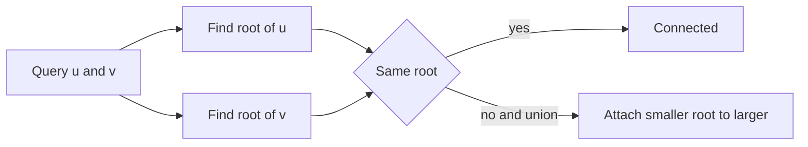

# Unionfind

- Source: Library Checker (YS)
- USACO Guide ID: `ys-UnionFind`
- Difficulty at selection: Easy
- Original problem: [https://judge.yosupo.jp/problem/unionfind](https://judge.yosupo.jp/problem/unionfind)
- Tags: Disjoint Set Union
- Solution: [`../../solutions/ys-UnionFind.cpp`](../../solutions/ys-UnionFind.cpp)

## Problem Summary

Start with isolated graph vertices. Process operations that add an undirected connection or ask whether two vertices are already connected through any path.

This is a paraphrase for study notes. Use the original link for the official statement and constraints.

## Visualization Description

Each connected component is represented as a shallow rooted tree. A root is the component's label. Joining components points the smaller tree's root at the larger tree's root; searching compresses the visited path.

## Approach

Use a disjoint set union structure with a parent and component size for every vertex. `find` follows parents to the representative and applies path compression. `unite` finds both representatives and attaches the smaller component to the larger. A connectivity query compares representatives.

## Correctness

Initially, every singleton set exactly matches one isolated vertex. A union operation merges precisely the two components containing its endpoints, so the DSU partition continues to match the graph's connected components. Path compression and union by size change only the internal representative trees, not set membership. Therefore, two vertices have the same representative exactly when a graph path connects them.

## Complexity

- Time: `O((N + Q) alpha(N))`, effectively linear
- Extra space: `O(N)`

## Verification

The smoke test includes repeated connectivity checks before and after unions, plus a union between vertices that are already connected.
