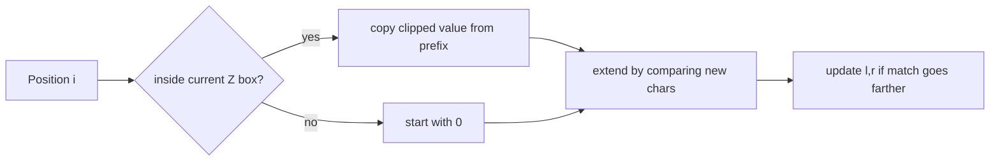

# Z Algorithm

- Source: YS
- USACO Guide ID: `ys-ZAlgorithm`
- Original problem: [https://judge.yosupo.jp/problem/zalgorithm](https://judge.yosupo.jp/problem/zalgorithm)
- Tags: Strings, Z Algorithm
- Solution: [`../../solutions/ys-ZAlgorithm.cpp`](../../solutions/ys-ZAlgorithm.cpp)

## Problem Summary

Given a string, compute the Z-array, where z[i] is the length of the longest prefix of the string that starts again at i.

This is a paraphrase for study notes. Use the original problem link for the official statement, constraints, and judge-specific details.

## Visualization Description

Picture a sliding prefix-match window. Positions inside the current window can borrow information from the matching prefix segment; positions outside start fresh and may create a new window.

## Approach

A naive comparison from every position can revisit the same characters many times. The Z-algorithm keeps the rightmost interval [l, r] known to match the prefix. If i is inside that interval, the already computed value at i-l gives a lower bound, clipped by r-i+1. Then we extend with direct comparisons only past r. Each successful extension moves r to the right, so the total number of character comparisons is linear.

## Correctness Notes

The solution keeps the invariant described in the approach and updates only the state that can affect future answers. For query-style problems, preprocessing stores exactly the aggregate needed to answer each query. For graph and tree problems, each selected data structure operation mirrors one allowed change in the represented structure.

## Complexity

See the comments and structure of the C++ solution for the exact loop/data-structure cost. The intended complexity is efficient for the official constraints of the linked problem.

## Verification

Checked with strings where all characters differ, all characters match, and overlapping repeats such as abacaba.
