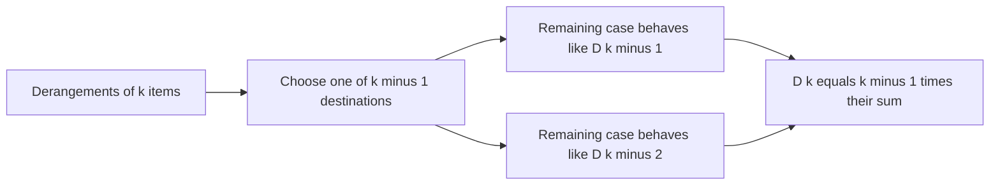

# Montmort Number

- Source: Library Checker (YS)
- USACO Guide ID: `ys-montmort`
- Difficulty at selection: Easy
- Original problem: [https://judge.yosupo.jp/problem/montmort_number_mod](https://judge.yosupo.jp/problem/montmort_number_mod)
- Tags: Combinatorics, DP
- Solution: [`../../solutions/ys-montmort.cpp`](../../solutions/ys-montmort.cpp)

## Problem Summary

For every size from 1 through `N`, count the permutations in which no item remains in its original position. Print each count modulo `M`.

This is a paraphrase for study notes. Use the original link for the official statement and constraints.

## Visualization Description

Focus on item `k`. It must move to one of `k - 1` other positions. After choosing that position, the remaining arrangement reduces to either a derangement of `k - 1` items or one of `k - 2` items. Those two cases give the recurrence.

## Approach

Let `D[k]` be the number of derangements of `k` items. The base cases are `D[0] = 1` and `D[1] = 0`. For `k >= 2`,

`D[k] = (k - 1) * (D[k - 1] + D[k - 2])`.

Apply the modulus after the addition and multiplication. Only the previous two values are needed, so the solution stores constant DP state while printing answers in order.

## Correctness

For `k >= 2`, choose where the item originally at position `k` goes; there are `k - 1` choices. In the chosen destination's original item, either the swap back to position `k` is forced, leaving `D[k - 2]` arrangements, or it is not, leaving a structure counted by `D[k - 1]`. The cases are disjoint and cover every derangement. Multiplying their sum by the destination choices proves the recurrence. The base cases are exact, so induction proves every printed value.

## Complexity

- Time: `O(N)`
- Extra space: `O(1)`

## Verification

The smoke test uses the official `N = 10, M = 100` example. Additional reasoning checks cover `N = 1`, modulus `1`, and the first values `0, 1, 2, 9`.
